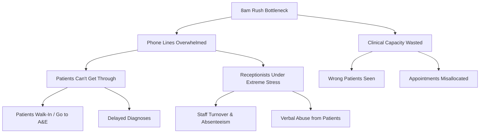
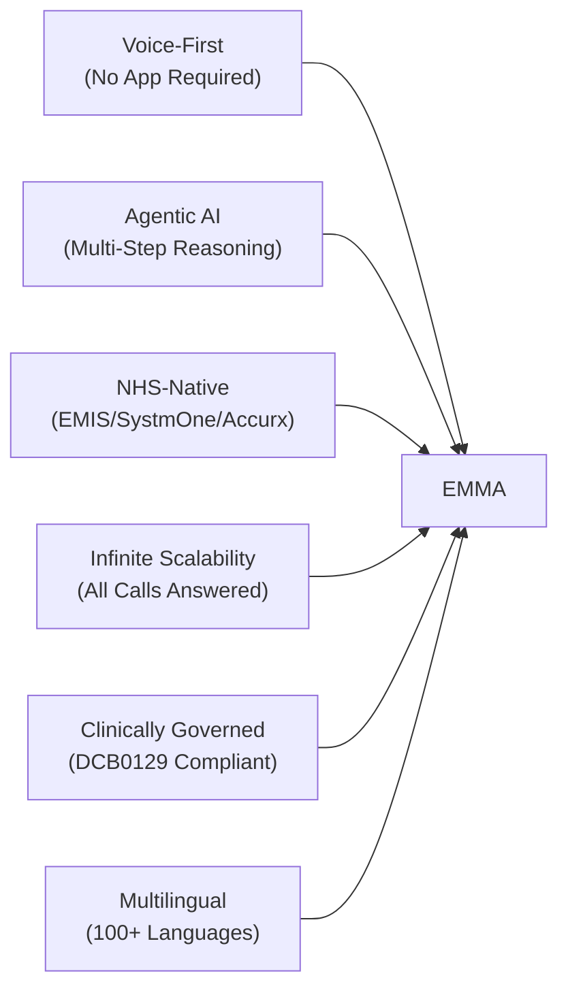
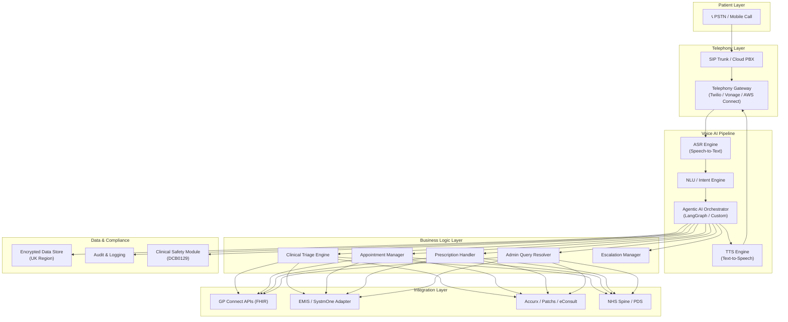
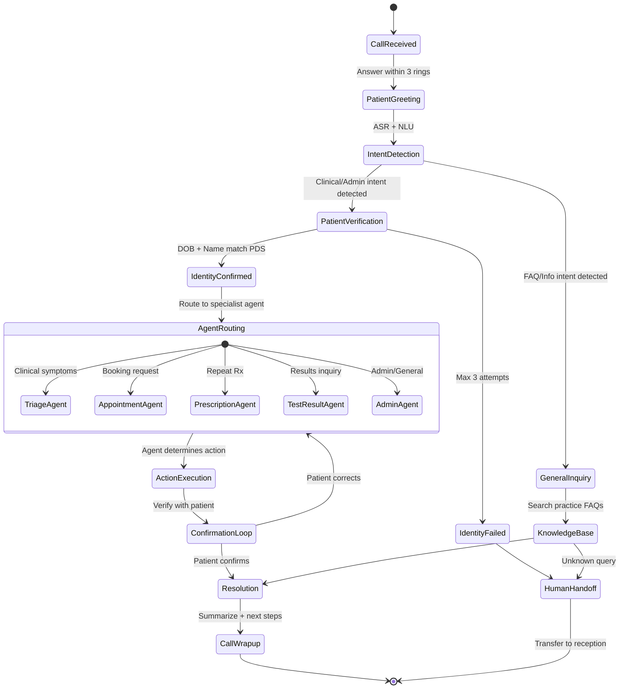
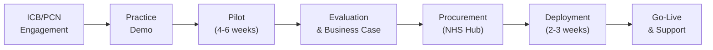

# EMMA — AI GP Receptionist
## Product Requirements Document (PRD)
### QuantumLoopAI | Version 1.0 | February 2026

---

## Table of Contents

1. [Executive Summary](#1-executive-summary)
2. [Market Context & Opportunity](#2-market-context--opportunity)
3. [Problem Statement](#3-problem-statement)
4. [Product Vision & Mission](#4-product-vision--mission)
5. [Target Users & Personas](#5-target-users--personas)
6. [Competitive Landscape](#6-competitive-landscape)
7. [Product Features & Requirements](#7-product-features--requirements)
8. [Technical Requirements](#8-technical-requirements)
9. [Compliance & Regulatory Requirements](#9-compliance--regulatory-requirements)
10. [Integration Requirements](#10-integration-requirements)
11. [Non-Functional Requirements](#11-non-functional-requirements)
12. [Business Model & Commercials](#12-business-model--commercials)
13. [Go-to-Market Strategy](#13-go-to-market-strategy)
14. [Success Metrics & KPIs](#14-success-metrics--kpis)
15. [Risks & Mitigations](#15-risks--mitigations)
16. [Roadmap](#16-roadmap)
17. [Appendix](#17-appendix)
 
---

## 1. Executive Summary

**EMMA** (Enterprise Medical Management Assistant) is QuantumLoopAI's flagship AI-powered GP receptionist, purpose-built for the UK's National Health Service (NHS) primary care ecosystem. EMMA replaces the dysfunctional "8am rush" — where thousands of patients simultaneously flood GP phone lines — with an always-on, infinitely scalable, clinically intelligent voice AI agent that answers every call within 3 rings, 24/7.

> [!IMPORTANT]
> EMMA is not a chatbot or IVR system. It is an **agentic AI system** built on multi-step reasoning, capable of understanding complex patient inquiries, navigating clinical protocols, and executing multi-step workflows (verify → triage → route → book) autonomously.

### Key Value Proposition

| Stakeholder | Value Delivered |
|---|---|
| **Patients** | Zero wait times, 24/7 access, multilingual support, faster appointment booking |
| **Receptionists** | 90%+ call burden removed, no abusive interactions, focus on in-person care |
| **GPs / Clinicians** | Pre-triaged patients, reduced consultation wastage, better clinical data |
| **Practice Managers** | Up to 80% cost reduction on call handling, measurable KPIs, DTAC compliance |
| **PCNs / ICBs** | Population-level access improvements, data-driven commissioning, CAP funding eligibility |

---

## 2. Market Context & Opportunity

### 2.1 The NHS Primary Care Crisis

The UK's 6,300+ GP practices handle **over 340 million patient contacts per year**. The BMA reports that the average GP practice now has **2,300+ patients per GP** (recommended: 1,600). The "8am rush" results in:

- **67% of patient contacts** start via telephone (first point of contact)
- Patients report waiting **25-45 minutes** on hold
- **30% of calls** go unanswered or are abandoned
- Receptionists handle **100-200+ calls per day**, leading to burnout and absenteeism
- Reception staff face **verbal abuse** from frustrated patients daily

### 2.2 Digital Telephony Transformation

The NHS has already upgraded **5,800+ GP practices** to cloud-based phone systems under the GP Access Recovery Plan (PCARP). This creates the infrastructure foundation for AI telephony overlays like EMMA.

### 2.3 Market Sizing

| Metric | Value |
|---|---|
| UK Digital Health Market (2024) | **$10.65-13.05 billion** |
| UK AI in Healthcare Market (2025) | **$422.89 million** |
| UK AI in Healthcare Market (2034 projected) | **$3,007 million** |
| AI Voice Agents in Healthcare Market (Global, 2024) | **$468 million** |
| CAGR — UK AI in Healthcare (2026-2034) | **24.35%** |
| Total addressable practices in England | **~6,300** |
| Average revenue per practice per year (est.) | **£30,000-£60,000** |
| **Total Addressable Market (UK GP practices)** | **£189M-£378M per year** |

### 2.4 Regulatory Tailwinds

- **NHS Long Term Plan** mandates digital-first primary care
- **Modern General Practice (MGP) Model** requires digital access tools from Oct 2025
- **PCARP digital tools funding** via ICBs (transitioning to core allocations FY25/26)
- **NHS England AI Test Framework** (T.E.S.T.) provides evaluation pathway
- **10-Year Health Plan** explicitly integrates AI into NHS strategy

---

## 3. Problem Statement

### Primary Problem
> GP surgeries in the UK are unable to manage the volume of inbound patient phone calls, leading to inaccessible care, frustrated patients, burned-out staff, and wasted clinical capacity.

### Root Causes

### Secondary Problems
1. **Inequitable access**: Non-English speakers and disabled patients disproportionately affected
2. **Data loss**: Phone conversations are not systematically captured or coded
3. **Misallocation of clinical resources**: Without triage, urgent cases wait while routine inquiries consume GP time
4. **Practice inefficiency**: Receptionists spend 70%+ of time on phone-based tasks that could be automated

---

## 4. Product Vision & Mission

### Vision
> **Make every patient's first contact with their GP practice effortless, instant, and clinically intelligent — regardless of time, language, or volume.**

### Mission
> Build the UK's most trusted AI receptionist for NHS primary care that eliminates phone queues, empowers reception teams, and ensures every patient inquiry reaches the right clinical outcome, safely and efficiently.

### Product Principles

| Principle | Description |
|---|---|
| **Clinically Safe** | Every interaction adheres to DCB0129 clinical risk management. EMMA never makes clinical decisions — she routes and triages safely. |
| **Patient-First** | Designed for patients who just want to "phone the surgery". No apps to download. No portals to register for. Just call. |
| **Staff Empowerment** | EMMA is a team member, not a replacement. Receptionists focus on meaningful, in-person work. |
| **NHS-Native** | Built for NHS workflows, not retrofitted from US/generic healthcare AI. Integrates with EMIS, SystmOne, Accurx, Patchs natively. |
| **Transparent & Auditable** | Every call is logged, transcribed, and available for clinical governance review. |

---

## 5. Target Users & Personas

### 5.1 Primary Users

#### Persona 1: **Margaret, 72 — The Elderly Patient**
- Calls her GP at 8:01am every time she needs help
- Doesn't use smartphones or patient portals
- Speaks English with a regional accent
- **Needs**: Instant answer, clear voice, patience, correct routing
- **Pain**: Waits 30+ minutes, gets cut off, gives up

#### Persona 2: **Fatima, 34 — The Working Mother**
- Needs to book for herself and her children
- Speaks Urdu at home, English at work
- Can only call during lunch breaks
- **Needs**: Multilingual support, fast resolution, flexible hours
- **Pain**: Can never get through during work hours, language barriers

#### Persona 3: **James, 28 — The Young Professional**
- Prefers calling over navigating complex NHS portals
- Wants test results and repeat prescriptions quickly
- **Needs**: Quick service, no waiting, clear automation
- **Pain**: "I just need my blood test results — why am I waiting 40 minutes?"

### 5.2 Practice Users

#### Persona 4: **Sarah — GP Receptionist**
- Handles 150+ calls per day
- Faces verbal abuse regularly
- Skilled but overwhelmed
- **Needs**: Relief from call volume, fewer abusive interactions, meaningful work
- **Pain**: Burnt out, considering leaving healthcare

#### Persona 5: **Dr. Khan — GP Partner**
- Responsible for practice operations and patient outcomes
- Concerned about access metrics for CQC inspections
- **Needs**: Reliable triage, data dashboards, compliance evidence
- **Pain**: Can't improve access without hiring more staff he can't afford

#### Persona 6: **Helen — PCN Manager / ICB Digital Lead**
- Oversees 15-20 practices in a PCN
- Responsible for CAP funding and digital strategy
- **Needs**: Population-level analytics, standardized tooling, cost efficiency
- **Pain**: Inconsistent technology adoption across practices

---

## 6. Competitive Landscape

### 6.1 Direct Competitors

| Company | Product | Approach | Market Share (SE England) | Key Strength | Key Weakness |
|---|---|---|---|---|---|
| **Anima** | Online triage/consultation | Web-form digital triage | **69%** | Dominant market share, strong NHS relationships | No voice/phone AI — requires patient to use web portal |
| **Klinik Access** | AI triage and routing | NLP-based symptom checker | **19%** | Good clinical signposting | Limited telephony integration |
| **InTouchNow** | AI Voice Receptionist | Hybrid AI/human call handling | **13%** | Voice-first approach | Smaller scale, less clinical depth |
| **eConsult** | Online consultation | Web-based patient forms | Historic national presence | Early mover, widely adopted | Not AI-native, requires internet literacy |
| **Hero Health** | Practice management | Online booking + messaging | Growing | Holistic platform play | Jack of all trades |
| **Patchs** | Online triage | AI clinical signposting | Regional presence | Strong clinical AI | Portal-dependent, no telephony |
| **Deep Medical** | AI receptionist | Predictive attendance + call handling | Emerging | NHS trust deployments | Hospital-focused, not primary care native |

### 6.2 EMMA's Competitive Moat

> [!TIP]
> **Critical Differentiator**: EMMA is the only AI receptionist that combines **voice-first telephony** (patients don't need apps/internet) with **agentic AI reasoning** (not a scripted IVR or simple chatbot) and **deep NHS clinical system integration** (reads/writes to EMIS/SystmOne via GP Connect).

---

## 7. Product Features & Requirements

### 7.1 Core Features (MVP)

#### F1: Intelligent Call Answering
| Attribute | Requirement |
|---|---|
| **Answer Time** | Within 3 rings (< 10 seconds) |
| **Concurrent Calls** | Unlimited / infinite capacity |
| **Availability** | 24 hours / 7 days / 365 days |
| **Languages** | English (all UK accents) + minimum 20 additional languages at launch |
| **Voice Quality** | Natural, human-like TTS with appropriate NHS tone (warm, professional, patient) |
| **Fallback** | Seamless handoff to human receptionist if EMMA cannot resolve |

#### F2: Clinical Triage & Routing
| Attribute | Requirement |
|---|---|
| **Symptom Assessment** | SNOMED CT-coded symptom capture with safety netting |
| **Urgency Classification** | 4-tier: Emergency (999) → Urgent (same-day) → Soon (48h) → Routine |
| **Clinical Protocols** | Configurable per-practice clinical pathways (e.g., chest pain → 999 immediate) |
| **Red Flags** | Mandatory safety netting for red-flag symptoms with immediate escalation |
| **Care Navigation** | Route to appropriate service: GP, Nurse, Pharmacist, 111, A&E, Mental Health |

#### F3: Appointment Management
| Attribute | Requirement |
|---|---|
| **Booking** | Book, reschedule, cancel appointments via voice |
| **Availability Search** | Real-time slot lookup from clinical system |
| **Multi-clinician** | Book with specific clinician types (GP, Nurse Practitioner, Pharmacist) |
| **Confirmation** | SMS/verbal confirmation with appointment details |
| **Waitlist** | Automated callback if preferred slot becomes available |

#### F4: Repeat Prescription Requests
| Attribute | Requirement |
|---|---|
| **Request Capture** | Voice-based medication request with verification |
| **Patient Verification** | DOB + NHS number or name + address + DOB |
| **Medication Matching** | Match patient request to medication list from clinical record |
| **Routing** | Send prescription request to appropriate GP for authorization |
| **Confirmation** | Status tracking and collection notification |

#### F5: Test Results Inquiries
| Attribute | Requirement |
|---|---|
| **Retrieval** | Secure access to coded test results from clinical system |
| **Delivery Rules** | Practice-configurable: some results verbal, some require GP callback |
| **Normal Results** | EMMA can communicate normal results with standard reassurance |
| **Abnormal Results** | Always routed to clinician; EMMA schedules callback/appointment |
| **Audit Trail** | Full log of what was communicated and when |

#### F6: Administrative Query Handling
| Attribute | Requirement |
|---|---|
| **Scope** | Opening hours, registration, sick notes, referral status, letter requests |
| **Knowledge Base** | Practice-specific FAQ answers, configurable by practice manager |
| **Form Generation** | Auto-generate admin tasks in clinical system (e.g., sick note request) |
| **Overflow** | Unknown queries routed to human receptionist with full context |

### 7.2 Advanced Features (Post-MVP)

#### F7: Proactive Outbound Calling
- Appointment reminders (reduce DNAs by predicted 25-40%)
- Chronic disease management callbacks
- Vaccination recall campaigns
- Health check invitations

#### F8: PCN / ICB Analytics Dashboard
- Population-level demand mapping
- Practice comparative benchmarking
- Capacity planning and forecasting
- Patient satisfaction tracking (CSAT/CES)
- Compliance reporting for CQC/ICB

#### F9: Multi-Channel Extension
- WhatsApp/SMS text-based interactions
- NHS App integration via GP Connect Patient Facing APIs
- Web widget for practice websites

#### F10: Clinical Decision Support (Future)
- AI-assisted care navigation with evidence-based pathways
- Integration with clinical guidelines (NICE/CKS)
- Population health risk stratification

---

## 8. Technical Requirements

### 8.1 Architecture Overview

### 8.2 Core Technology Stack

| Layer | Technology | Rationale |
|---|---|---|
| **Telephony** | Twilio Voice / Vonage Voice API / AWS Connect | Programmable voice, SIP trunking, UK number provisioning, PSTN bridging |
| **Speech-to-Text (ASR)** | Deepgram / Google Speech-to-Text Medical / Speechmatics | Low-latency real-time streaming, UK accent support, medical vocabulary |
| **Text-to-Speech (TTS)** | ElevenLabs / Google WaveNet / Amazon Polly Neural | Human-like voice quality, British accents, emotional tone control |
| **NLU / Intent** | Custom fine-tuned model + SNOMED CT entity extraction | NHS-specific intent recognition, clinical entity linking |
| **LLM / Reasoning** | GPT-4o / Claude 3.5 / Gemini Pro (via API) | Multi-step reasoning, protocol following, contextual conversation |
| **Agentic Orchestration** | LangGraph / Custom DAG Engine | Stateful multi-step workflows, tool calling, conditional branching |
| **Backend** | Python (FastAPI) / Node.js (NestJS) | High-performance async APIs, WebSocket support |
| **Integration** | FHIR R4 client, HL7v2 adapter, Accurx API | NHS-standard interoperability |
| **Database** | PostgreSQL + Redis | ACID compliance, session caching, real-time state |
| **Infrastructure** | AWS (London Region) / Azure (UK South) | UK data residency, NHS N3/HSCN connectivity |
| **Monitoring** | Datadog / Grafana + OpenTelemetry | Real-time call quality, latency, error tracking |
| **CI/CD** | GitHub Actions / GitLab CI | Automated testing, compliance gates, deployment |

### 8.3 Agentic AI Architecture

EMMA uses an **agentic architecture** — fundamentally different from scripted IVR or simple RAG chatbots.

#### Agent Types

| Agent | Responsibility | Tools Available |
|---|---|---|
| **Orchestrator Agent** | Overall call flow management, intent routing, context retention | All sub-agents, escalation triggers |
| **Triage Agent** | Clinical symptom assessment, urgency classification, safety netting | SNOMED CT lookup, clinical protocol engine, red-flag detector |
| **Appointment Agent** | Slot search, booking, rescheduling, cancellation | GP Connect Appointment API, slot optimizer |
| **Prescription Agent** | Medication request capture, verification, submission | GP Connect Medication API, medication fuzzy matcher |
| **Test Result Agent** | Result retrieval, communication rules, callback scheduling | GP Connect Access Record API, result delivery rules engine |
| **Admin Agent** | FAQ resolution, form generation, task creation | Practice knowledge base, clinical system task API |
| **Escalation Agent** | Human handoff, 999 escalation, urgent callback initiation | Phone transfer, SMS notification, receptionist alert |

### 8.4 Voice Pipeline Specifications

| Specification | Requirement |
|---|---|
| **End-to-end latency** | < 800ms from patient speech end to EMMA response start |
| **ASR accuracy** | > 95% word error rate on UK-accented English |
| **ASR medical accuracy** | > 90% on NHS clinical terminology |
| **TTS naturalness** | MOS score > 4.2/5.0 |
| **Interruption handling** | Barge-in capable (patient can interrupt EMMA) |
| **Silence detection** | 3-second silence → gentle prompt; 10-second → "Are you still there?" |
| **Background noise** | Robust to household/street noise |
| **Call recording** | Full call recording with consent, encrypted at rest |
| **Transcription** | Real-time transcription with speaker diarization |

---

## 9. Compliance & Regulatory Requirements

### 9.1 Mandatory NHS Compliance

| Standard | Scope | Status Required |
|---|---|---|
| **DTAC** | Digital Technology Assessment Criteria — 5 domains: clinical safety, data protection, technical assurance, interoperability, usability | **Full Compliance** |
| **DSPT** | Data Security and Protection Toolkit — 10 National Data Guardian standards | **Standards Met** |
| **DCB0129** | Clinical Risk Management for health IT manufacturers | **Clinical Safety Case Report + Hazard Log** |
| **DCB0160** | Clinical Risk Management for health IT deployers (practice responsibility, supported by QuantumLoopAI) | **Deployment Support Pack** |
| **UK GDPR** | Data Protection Act 2018 — lawful basis, DPIAs, subject rights | **Full Compliance** |
| **Cyber Essentials Plus** | NCSC-backed cyber security baseline | **Certified** |
| **ISO 27001** | Information Security Management System | **Certified or Aligned** |

### 9.2 Clinical Safety Requirements

> [!CAUTION]
> EMMA is classified as a **health IT system under DCB0129** due to its role in clinical triage and patient routing. Failure to maintain a Clinical Safety Case Report and active Hazard Log is a **deployment blocker**.

- **Clinical Safety Officer (CSO)**: Qualified CSO must approve all clinical safety documentation
- **Hazard Log**: Maintained throughout product lifecycle, documenting all identified clinical risks
- **Clinical Safety Case Report**: Comprehensive evidence of risk identification, assessment, and mitigation
- **Safety Netting**: Mandatory for all clinical interactions — if in doubt, escalate to human
- **Red Flag Protocols**: Zero-tolerance escalation for chest pain, breathing difficulty, stroke symptoms, suicidal ideation, safeguarding concerns

### 9.3 MHRA Considerations

EMMA's triage functionality may classify it as a **Software as a Medical Device (SaMD)** depending on:
- Whether it provides clinical decision support that influences clinical decisions
- Whether it falls under Class I, IIa, or IIb medical device classification

> [!WARNING]
> If EMMA provides clinical recommendations (beyond routing/signposting), it may require **UKCA marking** and MHRA registration. Current design deliberately limits EMMA to routing/triage **without clinical diagnosis or treatment recommendation** to remain below the SaMD classification threshold.

### 9.4 Data Residency & Processing

| Requirement | Implementation |
|---|---|
| **Data Residency** | All patient data stored in UK-only data centers (AWS London / Azure UK South) |
| **Encryption at Rest** | AES-256 for all stored data |
| **Encryption in Transit** | TLS 1.3 for all communications |
| **Data Retention** | Call recordings retained per practice data retention policy (default: 8 years) |
| **Right to Erasure** | Patient can request deletion of their call data |
| **Lawful Basis** | Legitimate interest (healthcare administration) / Contract (NHS service delivery) |
| **DPIA** | Completed and maintained for all processing activities |

---

## 10. Integration Requirements

### 10.1 Clinical System Integration

| System | Integration Method | Data Exchange |
|---|---|---|
| **EMIS Web** | GP Connect FHIR R4 APIs + Direct EMIS APIs | Read: Patient demographics, appointments, medications, results. Write: Appointments, tasks, messages |
| **TPP SystmOne** | GP Connect FHIR R4 APIs | Read: Patient demographics, appointments, medications, results. Write: Appointments, tasks |
| **Accurx** | Accurx Partner API | Send patient messages, trigger eConsults, send SMS notifications |
| **Patchs** | Patchs API / Webhook | Submit triage outcomes, create consultation requests |
| **eConsult** | eConsult API | Redirect patients to online consultation when appropriate |
| **NHS Spine / PDS** | Personal Demographics Service FHIR API | Patient identity verification, NHS number lookup |
| **NHS Terminology Server** | SNOMED CT FHIR API | Clinical coding for symptoms and conditions |

### 10.2 Telephony Integration

| Integration | Description |
|---|---|
| **Existing Practice Phone System** | SIP trunk interfacing — EMMA sits in front of existing system, no hardware change |
| **Call Transfer** | Seamless warm transfer to human receptionists with full call context |
| **CLI Preservation** | Patient's calling number preserved for callback |
| **Voicemail** | Out-of-hours voicemail with AI transcription and categorization |
| **Multi-site** | Support for practices with multiple phone numbers / sites |

### 10.3 NHS Network Connectivity

| Requirement | Implementation |
|---|---|
| **HSCN** | Health and Social Care Network compliance for NHS system access |
| **N3 / Internet** | Hybrid connectivity model — HSCN for clinical data, internet for telephony |
| **GP Connect Connectivity** | Spine connection via HSCN for GP Connect API access |

---

## 11. Non-Functional Requirements

### 11.1 Performance

| Metric | Target |
|---|---|
| **Call Answer Time** | < 10 seconds (3 rings) |
| **Voice Response Latency** | < 800ms end-to-end |
| **Concurrent Call Capacity** | 10,000+ simultaneous calls (platform level) |
| **Per-Practice Capacity** | Unlimited concurrent calls |
| **API Response Time** | < 200ms for clinical system queries |
| **Uptime** | 99.95% (< 4.38 hours downtime/year) |

### 11.2 Scalability

| Dimension | Requirement |
|---|---|
| **Horizontal Scaling** | Auto-scale voice pipeline instances based on call volume |
| **Multi-tenancy** | Single platform serving 1,000+ practices with isolated configurations |
| **Peak Load** | Handle 10x normal volume (Monday mornings, pandemic spikes) |

### 11.3 Accessibility

| Requirement | Implementation |
|---|---|
| **WCAG 2.1 AA** | For all web-based dashboards and patient-facing interfaces |
| **Hearing Impairment** | SMS/text alternative pathway for deaf/HoH patients |
| **Cognitive Accessibility** | Clear, simple language; patience; repetition; slower speech on request |
| **Language** | 20+ languages at launch, expandable |

### 11.4 Disaster Recovery

| Requirement | Implementation |
|---|---|
| **RPO** | < 1 hour (Recovery Point Objective) |
| **RTO** | < 4 hours (Recovery Time Objective) |
| **Failover** | Automatic failover to secondary region |
| **Fallback** | If EMMA is down, calls route directly to practice phone system |

---

## 12. Business Model & Commercials

### 12.1 Pricing Model

| Tier | Target | Pricing Model | Estimated Price |
|---|---|---|---|
| **EMMA Essentials** | Single GP practice (< 10,000 patients) | Per-practice/month subscription | £1,500-£2,500/month |
| **EMMA Professional** | Multi-site practice / PCN | Per-practice/month with volume discount | £1,200-£2,000/month per practice |
| **EMMA Enterprise** | ICB-wide deployment | Annual contract, per-practice pricing | £1,000-£1,500/month per practice |

### 12.2 Revenue Streams

1. **SaaS Subscription** — Monthly/annual recurring revenue per practice
2. **Implementation Fee** — One-time setup and integration (£2,000-£5,000)
3. **Premium Modules** — Outbound calling, analytics dashboard, multi-channel
4. **Professional Services** — Custom clinical protocol configuration, training

### 12.3 NHS Funding Alignment

| Funding Source | EMMA Eligibility |
|---|---|
| **ICB Core Allocations** | ✅ Digital tools now funded from ICB core budgets (FY25/26 onwards) |
| **CAP (Capacity & Access Payment)** | ✅ EMMA directly supports access improvement metrics required for CAP |
| **PCN Network DES** | ✅ Supports digital access requirements under network contract |
| **PCARP Digital Tools** | ⚠️ Dedicated funding stream ended; replaced by core ICB funding |

### 12.4 ROI for a Typical Practice

| Metric | Current State | With EMMA |
|---|---|---|
| **Calls answered** | ~60-70% | 100% |
| **Avg. patient wait time** | 25-45 min | < 10 sec |
| **Receptionist call hours/day** | 6-8 hours | 1-2 hours (complex queries only) |
| **Locum receptionist costs** | £15,000-£25,000/year | Eliminated |
| **Patient complaints (access)** | 30-50/month | < 5/month |
| **DNA rate** | 5-8% | 3-5% (with outbound reminders) |

---

## 13. Go-to-Market Strategy

### 13.1 Beachhead: London & South East

- Target ICBs and PCNs in London, where digital adoption is highest
- Leverage existing practice reference sites (Dr. Cayetano Rebora advocacy)
- Partner with cloud telephony providers already deployed in practices

### 13.2 Channel Strategy

| Channel | Approach |
|---|---|
| **Direct Sales** | Dedicated NHS account managers for ICB/PCN engagement |
| **Partner Channel** | Telephony providers (X-on, BT Health, Accurx) resell EMMA |
| **NHS Frameworks** | List on NHS Digital Health Marketplace, G-Cloud |
| **Clinical Champions** | GP partners who advocate for EMMA within their PCN/ICB |
| **Events** | HETT, Digital Health Rewired, NHS ConfedExpo |

### 13.3 Sales Cycle

---

## 14. Success Metrics & KPIs

### 14.1 Patient Metrics

| KPI | Target (Year 1) |
|---|---|
| Call answer rate | 100% |
| Average wait time | < 10 seconds |
| Patient satisfaction (CSAT) | > 85% |
| Call resolution rate (no human needed) | > 70% |
| Multilingual call completion | > 90% |

### 14.2 Practice Metrics

| KPI | Target (Year 1) |
|---|---|
| Receptionist call volume reduction | > 80% |
| Staff satisfaction improvement | > 30% uplift |
| Appointment utilization | > 5% improvement |
| DNA rate reduction | > 25% reduction |

### 14.3 Business Metrics

| KPI | Target (Year 1) |
|---|---|
| Practices deployed | 200+ |
| Monthly Recurring Revenue | £4M+ |
| Net Revenue Retention | > 110% |
| Churn Rate | < 5% annual |
| NPS (Practice Managers) | > 50 |

### 14.4 Technical Metrics

| KPI | Target |
|---|---|
| Platform uptime | > 99.95% |
| Voice response latency (P95) | < 800ms |
| ASR accuracy | > 95% |
| Clinical safety incidents | 0 (zero tolerance) |
| Escalation success rate | 100% of red flags reach human |

---

## 15. Risks & Mitigations

| Risk | Severity | Likelihood | Mitigation |
|---|---|---|---|
| **Clinical safety incident** (EMMA gives incorrect triage) | 🔴 Critical | Low | DCB0129 compliance, mandatory red-flag protocols, conservative triage thresholds, human-in-loop for all clinical uncertainty |
| **MHRA classification as medical device** | 🟠 High | Medium | Design EMMA as routing/signposting tool, not diagnostic. Legal review of SaMD boundary. |
| **Data breach / GDPR violation** | 🔴 Critical | Low | ISO 27001, Cyber Essentials Plus, encryption, DSPT compliance, regular pen testing |
| **Competitor commoditization** (Anima/Klinik add voice) | 🟠 High | Medium | Maintain agentic AI advantage, deep integration moat, clinical governance leadership |
| **NHS procurement delays** | 🟡 Medium | High | Multi-channel GTM, direct practice sales alongside ICB deals, pilot-first approach |
| **AI hallucination in clinical context** | 🔴 Critical | Medium | Constrained output generation, protocol-driven responses (not free-form), clinical guardrails, mandatory safety nets |
| **Patient trust / AI resistance** | 🟡 Medium | Medium | Transparent disclosure ("I'm EMMA, your AI receptionist"), opt-out to human always available, train-the-patient education |
| **Integration fragility** (GP Connect downtime) | 🟡 Medium | Medium | Graceful degradation, offline mode for basic queries, queue and retry for system writes |

---

## 16. Roadmap

### Phase 1: Foundation (Months 1-4)
- [x] Core voice pipeline (ASR → NLU → LLM → TTS)
- [x] Basic call handling (greeting, intent detection, human handoff)
- [x] EMIS Web integration (appointments, demographics)
- [x] DCB0129 Clinical Safety Case v1
- [x] DTAC self-assessment submission
- [x] 3 pilot practices in London

### Phase 2: Clinical Intelligence (Months 5-8)
- [ ] Clinical triage engine with SNOMED CT coding
- [ ] Prescription request handling
- [ ] Test results communication
- [ ] SystmOne integration
- [ ] Accurx integration
- [ ] Multilingual support (top 10 languages)
- [ ] 50+ practices deployed

### Phase 3: Scale & Analytics (Months 9-12)
- [ ] PCN/ICB analytics dashboard
- [ ] Proactive outbound calling (appointment reminders)
- [ ] Advanced care navigation
- [ ] G-Cloud listing
- [ ] 200+ practices deployed
- [ ] ISO 27001 certification

### Phase 4: Platform Expansion (Year 2)
- [ ] Multi-channel (SMS, WhatsApp, NHS App)
- [ ] AI-powered workforce capacity planning
- [ ] Secondary care / hospital outpatient extension
- [ ] International expansion (Commonwealth markets)
- [ ] 1,000+ practices

---

## 17. Appendix

### A. Glossary

| Term | Definition |
|---|---|
| **PCN** | Primary Care Network — groups of GP practices working together (typically 30,000-50,000 patients) |
| **ICB** | Integrated Care Board — NHS organizations responsible for local healthcare commissioning |
| **CAP** | Capacity and Access Payment — NHS funding linked to access improvement metrics |
| **PCARP** | Primary Care Access Recovery Plan — NHS England's initiative to improve GP access |
| **DTAC** | Digital Technology Assessment Criteria — NHS baseline standard for digital health tools |
| **DSPT** | Data Security and Protection Toolkit — NHS data security compliance framework |
| **DCB0129** | Clinical Risk Management standard for health IT system manufacturers |
| **SNOMED CT** | Systematised Nomenclature of Medicine — Clinical Terms (NHS clinical coding standard) |
| **GP Connect** | NHS programme providing standardized FHIR APIs for accessing GP clinical data |
| **FHIR** | Fast Healthcare Interoperability Resources — HL7 standard for healthcare data exchange |
| **EMIS Web** | Leading GP clinical system used by ~55% of UK practices |
| **SystmOne** | TPP's GP clinical system used by ~35% of UK practices |
| **ASR** | Automatic Speech Recognition (Speech-to-Text) |
| **TTS** | Text-to-Speech |
| **NLU** | Natural Language Understanding |
| **SaMD** | Software as a Medical Device |
| **HSCN** | Health and Social Care Network — secure NHS network |
| **PDS** | Personal Demographics Service — NHS patient identity service |

### B. Referenced Standards & Regulations

| Standard | Source |
|---|---|
| DCB0129 | [NHS Digital Clinical Safety](https://digital.nhs.uk/services/clinical-safety) |
| DTAC | [NHS Innovation](https://transform.england.nhs.uk/key-tools-and-info/digital-technology-assessment-criteria-dtac/) |
| DSPT | [NHS Digital DSPT](https://www.dsptoolkit.nhs.uk/) |
| GP Connect | [NHS Developer](https://developer.nhs.uk/apis/gpconnect/) |
| FHIR UK Core | [NHS Digital FHIR](https://digital.nhs.uk/services/fhir-uk-core) |
| SNOMED CT | [NHS Terminology Server](https://ontology.nhs.uk/) |
| ISO 27001 | [ISO Information Security](https://www.iso.org/isoiec-27001-information-security.html) |
| UK GDPR | [ICO](https://ico.org.uk/for-organisations/uk-gdpr-guidance-and-resources/) |

---

*Document maintained by QuantumLoopAI Product Team*
*Last updated: February 2026*
*Classification: Internal — Confidential*
