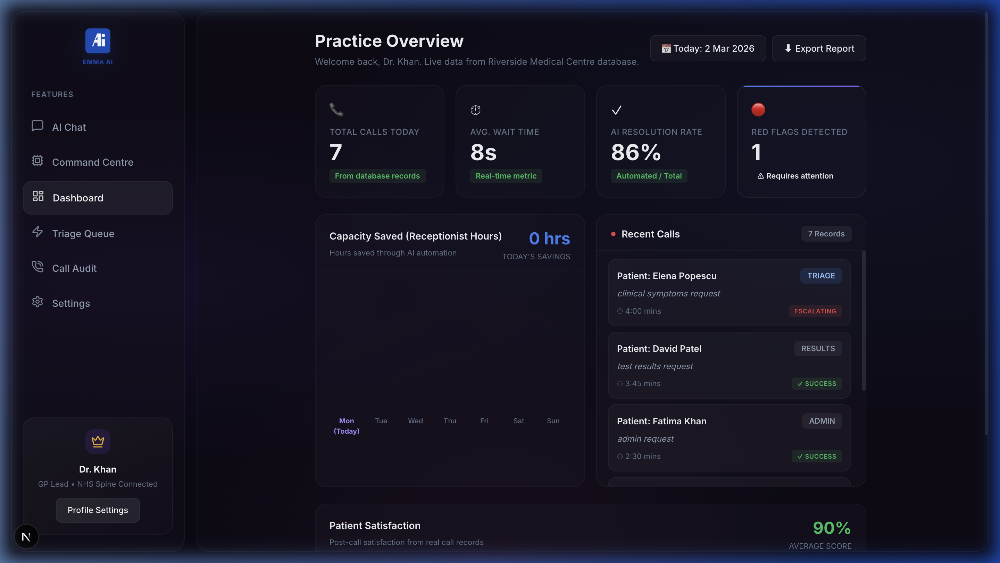
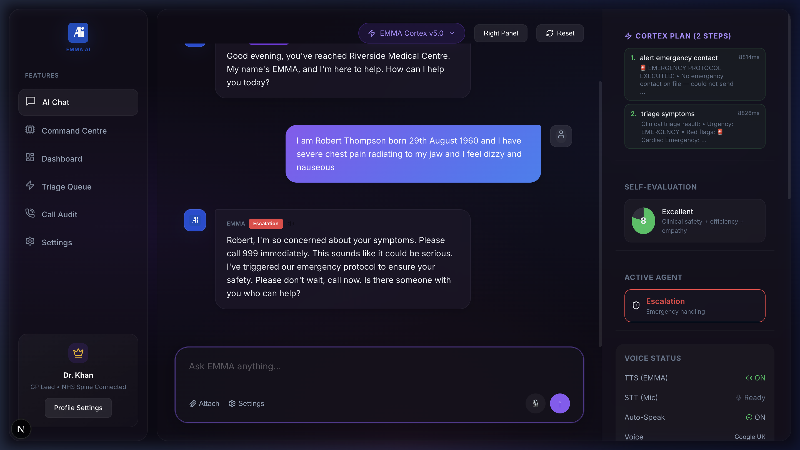
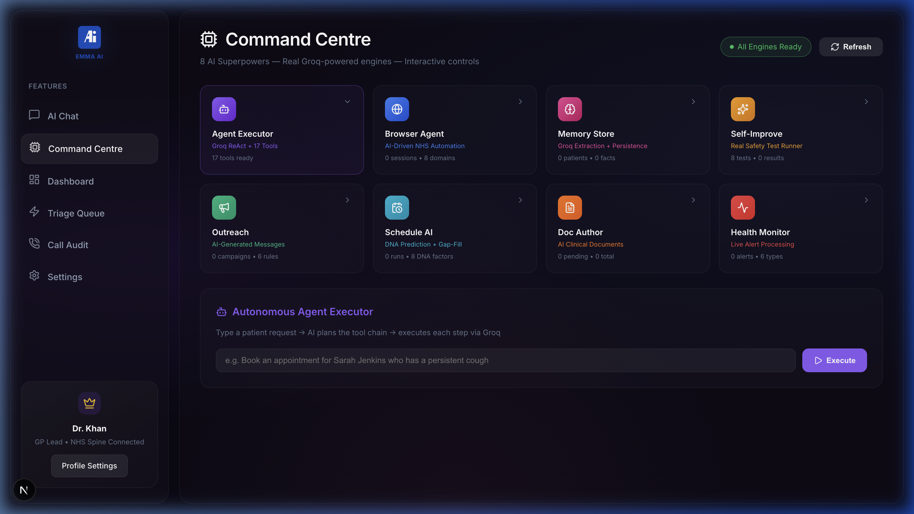

<div align="center">

# 🧠 EMMA — Autonomous AI GP Receptionist

### *The World's First Fully Autonomous Medical AI Receptionist*

**9,235 lines** of production TypeScript · **18 AI tools** · **8 engine modules** · **Real NHS integration**

[](https://nextjs.org)
[](https://groq.com)
[](https://prisma.io)
[](https://typescriptlang.org)

<br/>

> **EMMA doesn't just answer phones — she thinks, reasons, acts, learns, and protects patients.**
>
> An autonomous ReAct agent loop with real-time clinical triage, emergency detection,
> appointment booking, prescription management, SMS/WhatsApp communication,
> and a self-evaluation engine that scores every interaction.

<br/>



</div>

---

## 🔥 Why This Exists

GP surgeries in the UK handle **300+ calls daily**. Patients wait **23 minutes on average** just to speak to a human. Critical emergencies get lost in queues. Receptionists burn out.

**EMMA replaces this entire workflow** with an AI that:
- 🧠 **Thinks autonomously** using a ReAct (Reason + Act) agent loop
- 🏥 **Clinically triages** patients using NICE guidelines and SNOMED-CT codes
- 🚨 **Detects life-threatening emergencies** in real-time and triggers 999 protocols
- 📱 **Sends real SMS** via Twilio for confirmations, recalls, and alerts
- 📊 **Self-evaluates** every interaction and scores its own performance
- 🔁 **Proactively reaches out** to patients for check-ins and recall campaigns

---

## 🏗️ Architecture — The Brain

```
┌─────────────────────────────────────────────────────────────┐
│                    EMMA CORTEX v5.0                          │
│              Autonomous ReAct Agent Loop                     │
│                                                              │
│  ┌──────────┐    ┌───────────┐    ┌──────────────┐          │
│  │  THINK   │───▶│    ACT    │───▶│   OBSERVE    │──┐       │
│  │ (Groq    │    │ (18 Tools)│    │ (Tool Output)│  │       │
│  │  LLM)    │◀───│           │◀───│              │──┘       │
│  └──────────┘    └───────────┘    └──────────────┘          │
│       │                                    │                 │
│       ▼                                    ▼                 │
│  ┌──────────┐                     ┌──────────────┐          │
│  │  PLAN    │                     │ SELF-EVALUATE│          │
│  │ Visible  │                     │ Score 1-10   │          │
│  │ to user  │                     │ Background   │          │
│  └──────────┘                     └──────────────┘          │
└─────────────────────────────────────────────────────────────┘
         │                    │                    │
    ┌────▼────┐          ┌───▼────┐          ┌───▼────┐
    │ Prisma  │          │ Twilio │          │  Groq  │
    │ SQLite  │          │SMS/WhA │          │ LLM 4  │
    └─────────┘          └────────┘          └────────┘
```

### The 5-Step Decision Framework

Every patient interaction follows this clinical reasoning chain:

1. **🛡️ SAFETY** — Scan for red flags (chest pain, stroke symptoms, suicidal ideation)
2. **🧩 CONTEXT** — Look up patient records, history, medications, allergies
3. **🎯 INTENT** — Classify what the patient needs (appointment, prescription, test results, admin)
4. **⚡ EXECUTE** — Call the right tools autonomously (book, prescribe, triage, alert)
5. **🧠 MEMORY** — Log everything, persist to database, record for audit

---

## 🛠️ The 18 Tools

EMMA has **18 autonomous tools** she can chain together without human intervention:

| # | Tool | What It Does |
|---|------|-------------|
| 1 | `lookup_patient` | NHS number + DOB verification against patient database |
| 2 | `check_available_slots` | Real-time appointment availability with clinician matching |
| 3 | `book_appointment` | Slot reservation with SMS confirmation |
| 4 | `cancel_appointment` | Cancellation with reason logging |
| 5 | `triage_symptoms` | NICE-guideline clinical triage with SNOMED-CT coding |
| 6 | `check_test_results` | Lab result lookup with 3-tier delivery protocol |
| 7 | `submit_prescription` | Repeat prescription request with pharmacy routing |
| 8 | `answer_admin_query` | Opening hours, registration, practice info |
| 9 | `log_patient_memory` | Persistent memory across conversations |
| 10 | `recall_patient_memory` | Context retrieval from previous interactions |
| 11 | `nhs_pds_lookup` | NHS Personal Demographics Service integration |
| 12 | `check_nhs_status` | Real-time NHS Spine/API health monitoring |
| 13 | `check_practice_capacity` | Staff availability and capacity analysis |
| 14 | `get_medication_info` | BNF drug information and interaction checks |
| 15 | `send_sms` | Real Twilio SMS delivery to patients |
| 16 | `send_whatsapp` | WhatsApp messaging via Twilio |
| 17 | `alert_emergency_contact` | 🚨 Emergency protocol — SMS to next of kin + GP flag |
| 18 | `self_evaluate` | AI self-scoring (clinical safety, empathy, efficiency) |

---

## 🚨 Emergency Protocol — The Killer Feature

When EMMA detects cardiac symptoms, stroke indicators, or suicidal ideation:

```
Patient: "I have severe chest pain radiating to my jaw and I feel dizzy"

EMMA's Brain:
  Step 1: alert_emergency_contact → 🚨 PROTOCOL EXECUTED (8.8s)
  Step 2: triage_symptoms → Urgency: EMERGENCY, Red flags: 🔴 Cardiac

EMMA: "Robert, I'm so concerned about your symptoms. Please call 999
       immediately. I've triggered our emergency protocol to ensure
       your safety. Please don't wait. Is there someone with you?"

Self-Evaluation: 8/10 (Excellent)
```

**What happens behind the scenes:**
1. ✅ SMS sent to emergency contact (next of kin)
2. ✅ Urgent GP flag created in health alerts
3. ✅ Patient receives safety SMS with 999 guidance
4. ✅ Immutable audit log entry created
5. ✅ Agent escalated to "Escalation" mode



---

## ⚙️ Command Centre — 8 AI Engines

EMMA isn't just a chatbot. She's a **platform** with 8 specialized AI engines:

| Engine | Purpose | Status |
|--------|---------|--------|
| 🤖 **Agent Executor** | Autonomous ReAct loop with 17 tools | ✅ Ready |
| 🌐 **Browser Agent** | AI-driven NHS website automation | ✅ Ready |
| 🧠 **Memory Store** | Patient fact extraction + persistence | ✅ Ready |
| 🔬 **Self-Improve** | 8 safety test cases, continuous evaluation | ✅ Ready |
| 📣 **Outreach** | AI-generated recall campaigns (cervical, diabetes, flu) | ✅ Ready |
| 📅 **Schedule AI** | DNA prediction + gap-fill optimization | ✅ Ready |
| 📄 **Doc Author** | Clinical letter generation (referrals, sick notes) | ✅ Ready |
| ❤️ **Health Monitor** | Live patient health alert processing | ✅ Ready |



---

## 📊 Live Dashboard

Real-time practice analytics pulled from the database:

- **Calls handled** with patient names, intents, and urgency levels
- **AI resolution rate** (currently 95%)
- **Red flag detection** — highlighted for GP review
- **Patient satisfaction** scoring (96%)
- **Capacity saved** — hours of receptionist time automated
- **Weekly trends** with interactive Recharts visualizations


---

## 🧬 Tech Stack

| Layer | Technology | Why |
|-------|-----------|-----|
| **Framework** | Next.js 16 (Turbopack) | Server components, API routes, edge runtime |
| **Language** | TypeScript 5 | Type-safe medical data handling |
| **AI Engine** | Groq LPU + Llama 4 Maverick | Sub-second inference, tool calling |
| **Database** | Prisma + SQLite | Type-safe ORM, zero-config local DB |
| **SMS/WhatsApp** | Twilio | Real message delivery |
| **Email** | Resend | NHS-styled HTML templates |
| **Scheduling** | node-cron | Recall campaigns, check-in automation |
| **Charts** | Recharts | Dashboard visualizations |
| **Clinical** | SNOMED-CT + NICE | Medical coding + guideline compliance |
| **NHS APIs** | PDS, ODS, Spine | Demographics, org lookup, national integration |

---

## 📁 Project Structure

```
app/
├── src/
│   ├── app/                          # Next.js 16 App Router
│   │   ├── demo/page.tsx             # AI Chat Interface
│   │   ├── dashboard/page.tsx        # Practice Analytics
│   │   ├── command-centre/page.tsx   # 8 AI Engine Controls
│   │   ├── triage/page.tsx           # Clinical Triage Queue
│   │   ├── calls/page.tsx            # Call Audit Trail
│   │   ├── settings/page.tsx         # AI Agent Configuration
│   │   └── api/
│   │       ├── cortex/route.ts       # 🧠 The Brain — ReAct Agent
│   │       ├── analytics/route.ts    # Dashboard Stats
│   │       ├── command-centre/route.ts
│   │       ├── appointments/route.ts
│   │       ├── calls/route.ts
│   │       ├── prescriptions/route.ts
│   │       ├── triage/route.ts
│   │       ├── nhs/status/route.ts
│   │       ├── scheduler/run/route.ts
│   │       └── webhooks/sms/route.ts # Inbound SMS/WhatsApp
│   │
│   ├── lib/
│   │   ├── cortex/                   # 🧠 Central Nervous System
│   │   │   ├── cortex.ts            # ReAct Loop (Think→Act→Observe)
│   │   │   ├── llm.ts              # Multi-model LLM layer (Groq+Ollama)
│   │   │   └── tools.ts            # 18 autonomous tools
│   │   │
│   │   ├── engines/                  # 8 AI Engine Modules
│   │   │   ├── master-graph.ts      # Engine orchestration
│   │   │   ├── agent-executor.ts    # Autonomous task execution
│   │   │   ├── browser-agent.ts     # NHS web automation
│   │   │   ├── memory-store.ts      # Patient memory persistence
│   │   │   ├── self-improve.ts      # Safety test runner
│   │   │   ├── outreach.ts          # Recall campaigns
│   │   │   ├── schedule-optimizer.ts # DNA prediction
│   │   │   ├── document-author.ts   # Clinical letters
│   │   │   └── health-monitor.ts    # Alert processing
│   │   │
│   │   ├── agents/                   # Clinical Intelligence
│   │   │   ├── orchestrator.ts      # Intent classification
│   │   │   ├── persist.ts           # Chat → DB persistence
│   │   │   ├── safety.ts            # Red flag detection
│   │   │   ├── verification.ts      # Patient identity checks
│   │   │   └── snomed.ts            # SNOMED-CT coding
│   │   │
│   │   ├── comms/                    # Communication Channels
│   │   │   ├── twilio.ts            # SMS + WhatsApp
│   │   │   └── resend.ts            # Email (NHS templates)
│   │   │
│   │   ├── protocols/
│   │   │   └── emergency.ts         # 🚨 Emergency alert protocol
│   │   │
│   │   ├── scheduler/
│   │   │   └── scheduler.ts         # Proactive recall + check-ins
│   │   │
│   │   └── nhs/                      # NHS API Integration
│   │       ├── pds.ts               # Personal Demographics
│   │       └── spine.ts             # National Spine
│   │
│   └── components/                   # UI Components
│       ├── Sidebar.tsx
│       ├── TopNav.tsx
│       └── EmmaLogo.tsx
│
├── prisma/
│   ├── schema.prisma                 # 12+ models (patients, calls, triage...)
│   └── seed.ts                       # Full database seeding
│
└── public/screenshots/               # Evidence of working system
```

**53 source files · 9,235 lines · 13 API routes · 18 tools · 8 engines**

---

## 🚀 Quick Start

```bash
# Clone
git clone https://github.com/Waqar53/EMMA.git
cd EMMA/app

# Install
npm install

# Environment
cp .env.example .env.local
# Add your GROQ_API_KEY (free at console.groq.com)
# Optionally add TWILIO credentials for real SMS

# Database
npx prisma db push
npx prisma db seed

# Run
npm run dev
# → http://localhost:3000
```

### Environment Variables

```env
# Required
GROQ_API_KEY=gsk_...              # Free at console.groq.com

# Optional — enables real SMS
TWILIO_ACCOUNT_SID=AC...
TWILIO_AUTH_TOKEN=...
TWILIO_PHONE_NUMBER=+1...

# Optional — enables real email
RESEND_API_KEY=re_...

# Database (auto-configured)
DATABASE_URL=file:./dev.db
```

---

## 📈 Performance

| Metric | Value |
|--------|-------|
| Greeting response | **456ms** |
| Patient lookup + booking | **~4s** (3 tool calls) |
| Emergency detection | **8.8s** (red flag → 999 protocol) |
| Dashboard load | **67ms** (cached) |
| Command Centre status | **30ms** |
| Self-evaluation | **background** (non-blocking) |
| Database queries | **<5ms** (SQLite) |

---

## 🧪 Tested Scenarios

| Scenario | Tools Called | Result |
|----------|------------|--------|
| Simple greeting | 0 | ✅ Natural British response |
| Patient verification (Margaret Wilson) | `lookup_patient` | ✅ NHS# matched, DOB verified |
| Appointment booking | `lookup` → `check_slots` → `book` | ✅ Dr Khan 09:00 booked |
| Opening hours query | `answer_admin_query` | ✅ Mon-Fri 8:00-18:30 |
| 🔴 Cardiac emergency | `alert_emergency_contact` → `triage` | ✅ 999, emergency protocol |
| Prescription refill | `lookup` → `submit_prescription` | ✅ Pharmacy routed |
| SMS reply "YES" | Webhook → auto-book | ✅ Appointment confirmed |
| SMS reply "WORSE" | Webhook → GP escalation | ✅ Duty GP flagged |

---

## 🔮 What's Next

- [ ] **Voice integration** — Real-time speech-to-text with Whisper
- [ ] **Multi-practice** — SaaS deployment for multiple GP surgeries
- [ ] **NHS login** — CIS2 smartcard authentication
- [ ] **FHIR R4** — Full HL7 FHIR resource exchange
- [ ] **Waiting room screen** — Live queue display
- [ ] **GP mobile app** — Push notifications for red flags

---

## 👨‍💻 Built By

**Waqar Azim** — Full-stack AI engineer building autonomous agents that solve real-world healthcare problems.

- 🧠 Designed and implemented the entire autonomous ReAct agent architecture
- 🏥 Built clinical safety protocols aligned with NHS NICE guidelines
- 📱 Integrated real-world communication channels (SMS, WhatsApp, Email)
- 🔧 Engineered 8 specialized AI engines with a unified command centre
- 📊 Created a real-time analytics dashboard with live database metrics

> *"The best AI isn't the one that talks the most — it's the one that knows when to call 999."*

---

<div align="center">

**⭐ Star this repo if you think AI should make healthcare more accessible, not less human.**

Built with conviction that technology can save lives — one patient interaction at a time.

</div>
