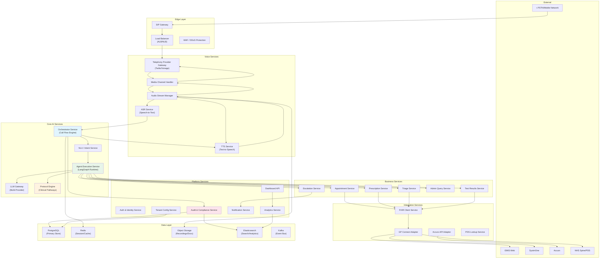
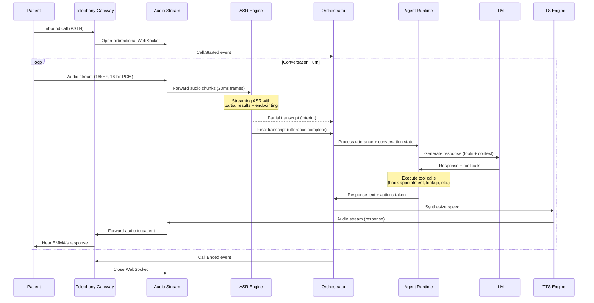
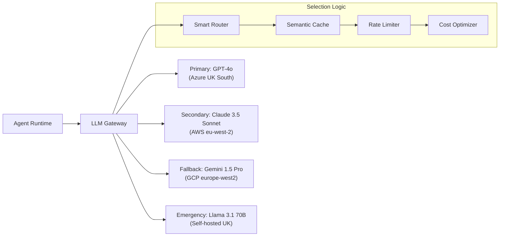
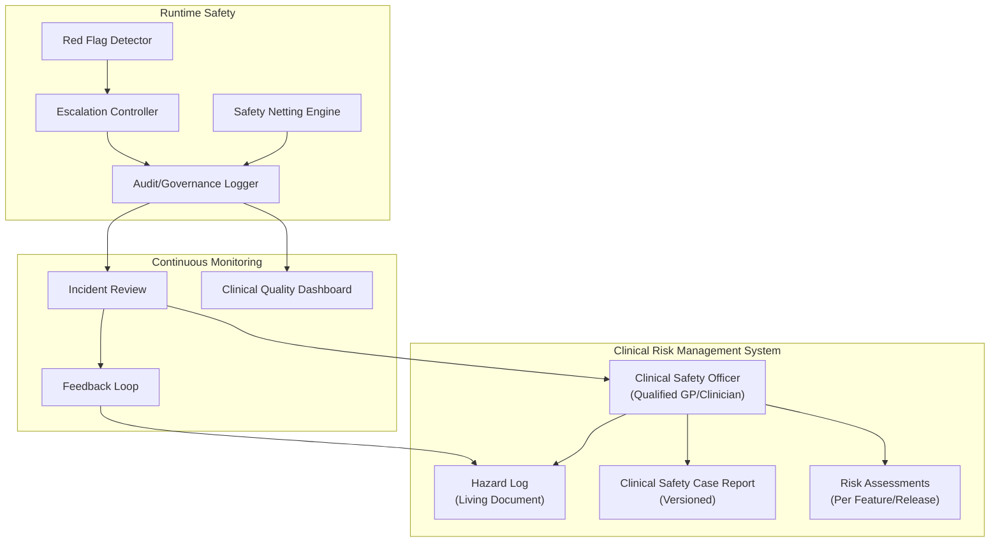
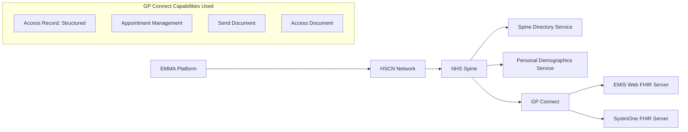
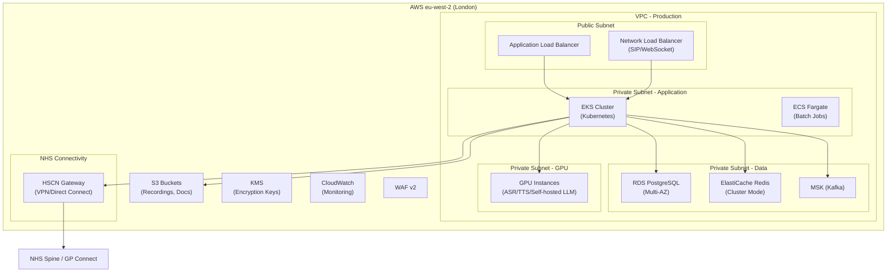
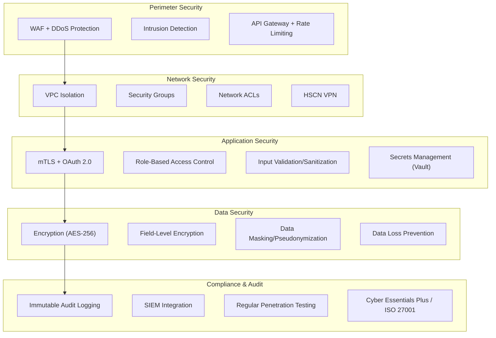

# EMMA — Technical Architecture & System Design
## Detailed Engineering Breakdown
### QuantumLoopAI | Version 1.0 | February 2026

---

## Table of Contents

1. [System Architecture Overview](#1-system-architecture-overview)
2. [Voice AI Pipeline — Deep Dive](#2-voice-ai-pipeline--deep-dive)
3. [Agentic AI Engine — Core Architecture](#3-agentic-ai-engine--core-architecture)
4. [Clinical Safety System](#4-clinical-safety-system)
5. [NHS Integration Layer](#5-nhs-integration-layer)
6. [Data Architecture & Storage](#6-data-architecture--storage)
7. [Infrastructure & Deployment](#7-infrastructure--deployment)
8. [Security Architecture](#8-security-architecture)
9. [Monitoring, Observability & Alerting](#9-monitoring-observability--alerting)
10. [Development Workflow & CI/CD](#10-development-workflow--cicd)
11. [Performance Engineering](#11-performance-engineering)
12. [Failure Modes & Recovery](#12-failure-modes--recovery)

---

## 1. System Architecture Overview

### 1.1 High-Level Architecture

EMMA is designed as a **cloud-native, event-driven, multi-tenant SaaS platform** with the following architectural principles:

| Principle | Implementation |
|---|---|
| **Microservices** | Decomposed into 12+ independently deployable services |
| **Event-Driven** | Asynchronous communication via message queues (Kafka/SQS) |
| **Multi-Tenant** | Single platform serving thousands of practices with config isolation |
| **Stateful Conversations** | Each call maintains a conversation state machine |
| **Fail-Safe Clinical Design** | Any system failure defaults to human handoff, never silence |

### 1.2 Service Architecture



### 1.3 Service Inventory

| Service | Language | Purpose | Scale Pattern |
|---|---|---|---|
| `telephony-gateway` | Go | SIP/WebSocket bridging, media stream management | Horizontal (per concurrent call) |
| `asr-service` | Python | Real-time speech-to-text streaming | GPU-backed, horizontal |
| `tts-service` | Python | Text-to-speech synthesis | GPU-backed, horizontal |
| `orchestrator` | Python (FastAPI) | Call flow state machine, agent routing | Horizontal (per active call) |
| `nlu-service` | Python | Intent classification, entity extraction | Horizontal |
| `agent-runtime` | Python (LangGraph) | Agentic AI execution, tool calling | Horizontal (per active agent) |
| `llm-gateway` | Python (FastAPI) | Multi-provider LLM routing, rate limiting, caching | Horizontal |
| `protocol-engine` | Python | Clinical pathway evaluation, safety checking | Horizontal |
| `appointment-service` | TypeScript (NestJS) | Appointment CRUD, slot optimization | Horizontal |
| `prescription-service` | TypeScript (NestJS) | Prescription request management | Horizontal |
| `triage-service` | Python | Clinical triage logic, SNOMED coding | Horizontal |
| `results-service` | TypeScript (NestJS) | Test result retrieval and delivery rules | Horizontal |
| `fhir-client` | TypeScript | FHIR R4 resource operations, GP Connect | Horizontal |
| `pds-service` | TypeScript | NHS PDS patient lookup and verification | Horizontal |
| `tenant-config` | TypeScript (NestJS) | Practice configuration management | Horizontal |
| `audit-service` | Go | Immutable audit logging, compliance | Horizontal |
| `analytics-service` | Python | Reporting, dashboards, insights | Horizontal |
| `notification-service` | TypeScript | SMS, email, push notifications | Horizontal |
| `dashboard-api` | TypeScript (NestJS) | Practice manager web dashboard API | Horizontal |

---

## 2. Voice AI Pipeline — Deep Dive

### 2.1 Real-Time Audio Processing Pipeline



### 2.2 ASR (Automatic Speech Recognition) Configuration

#### Provider Selection Matrix

| Provider | Strengths | Weaknesses | Use Case |
|---|---|---|---|
| **Deepgram Nova-2** | Lowest latency (~300ms), excellent streaming, good UK accent support | Less medical vocabulary OOB | Primary ASR for general conversation |
| **Google Cloud STT Medical** | Best medical terminology accuracy, speaker diarization | Higher latency (~500ms) | Fallback for clinical triage segments |
| **Speechmatics** | UK-engineered, excellent accent coverage, NHS deployments | Higher cost | Alternative primary for UK-specific requirements |

#### ASR Configuration

```yaml
asr_config:
  primary_provider: deepgram
  fallback_provider: google_cloud_medical
  
  deepgram:
    model: nova-2-medical
    language: en-GB
    sample_rate: 16000
    encoding: linear16
    channels: 1
    punctuate: true
    diarize: false  # Single speaker per channel
    smart_format: true
    endpointing: 500  # ms silence for utterance boundary
    interim_results: true
    utterance_end_ms: 1000
    vad_events: true
    keywords:
      - "appointment:2"
      - "prescription:2"
      - "blood test:2"
      - "chest pain:3"
      - "breathing:2"
      - "paracetamol:1"
      - "NHS number:2"

  custom_vocabulary:
    medical_terms:
      - ["paracetamol", "ibuprofen", "amoxicillin", "metformin", "amlodipine"]
      - ["HbA1c", "eGFR", "FBC", "LFT", "TFT", "INR", "PSA"]
      - ["hypertension", "diabetes", "asthma", "COPD", "eczema"]
    nhs_terms:
      - ["Accurx", "SystmOne", "EMIS", "NHS number"]
      - ["sick note", "fit note", "med3"]
```

### 2.3 TTS (Text-to-Speech) Configuration

#### Voice Profile: EMMA

```yaml
tts_config:
  primary_provider: elevenlabs
  fallback_provider: google_wavenet
  
  elevenlabs:
    voice_id: "emma_nhs_v3"  # Custom cloned/designed voice
    model: eleven_turbo_v2_5
    stability: 0.65
    similarity_boost: 0.80
    style: 0.35
    use_speaker_boost: true
    output_format: pcm_16000  # Match telephony channel
    
  voice_characteristics:
    accent: "Received Pronunciation (softened)"
    gender: female
    age_perception: "30-40 years old"
    tone: "warm, professional, patient, reassuring"
    pace: "moderate (adjustable per patient)"
    
  adaptive_behaviors:
    elderly_patient: 
      pace: "slow"
      volume: "slightly louder"
      repetition: "offer to repeat"
    anxious_patient:
      tone: "extra reassuring"
      pace: "calm, measured"
    child_calling:
      tone: "friendly, clear"
      language: "simplified"
```

### 2.4 Latency Budget

| Stage | Target | P50 | P95 | P99 |
|---|---|---|---|---|
| PSTN → SIP Gateway | < 50ms | 20ms | 40ms | 60ms |
| Audio buffering | < 100ms | 60ms | 80ms | 100ms |
| ASR streaming | < 300ms | 200ms | 280ms | 350ms |
| NLU + Intent | < 50ms | 20ms | 40ms | 60ms |
| Agent reasoning (LLM) | < 300ms | 150ms | 250ms | 400ms |
| TTS synthesis | < 150ms | 80ms | 120ms | 180ms |
| Audio delivery | < 50ms | 20ms | 40ms | 60ms |
| **Total end-to-end** | **< 800ms** | **550ms** | **750ms** | **1,010ms** |

> [!NOTE]
> The 800ms target ensures conversational fluency. Human conversation has natural pauses of 200-600ms between turns; EMMA's response within this window feels natural rather than robotic.

### 2.5 Barge-In (Interruption) Handling

```python
class BargeInHandler:
    """
    Handles patient interruptions during EMMA's speech.
    
    When a patient starts speaking while EMMA is talking:
    1. Detect voice activity (VAD) on patient channel
    2. If sustained > 200ms, trigger barge-in
    3. Stop TTS playback immediately
    4. Buffer patient speech from interruption point
    5. Process interrupted utterance as new input
    """
    
    VAD_THRESHOLD_MS = 200      # Min speech duration to trigger barge-in
    FADE_OUT_MS = 100           # Audio fade-out duration for smooth cutoff
    BUFFER_LOOKBACK_MS = 500    # Pre-buffer to capture start of interruption
    
    async def on_patient_voice_detected(self, audio_frame):
        if self.is_emma_speaking and self.vad_duration >= self.VAD_THRESHOLD_MS:
            await self.stop_tts_playback(fade_out=self.FADE_OUT_MS)
            buffered_audio = self.get_lookback_buffer()
            await self.orchestrator.process_interruption(buffered_audio)
```

---

## 3. Agentic AI Engine — Core Architecture

### 3.1 Why Agentic, Not Scripted

Traditional IVR/chatbot approaches fail in healthcare because:

| Traditional Approach | Problem | EMMA's Agentic Approach |
|---|---|---|
| Decision trees | Can't handle ambiguous patient descriptions | LLM-powered natural language understanding |
| Rigid scripts | "Press 1 for appointments, 2 for prescriptions" | Free-form conversation with intent detection |
| Single-step commands | Can't chain: verify → check slots → book → confirm | Multi-step tool-calling workflows |
| No clinical context | Generic routing | SNOMED-coded clinical understanding |
| No state memory | Forgets mid-conversation | Persistent conversation state graph |

### 3.2 LangGraph-Based Agent Architecture

```python
# Simplified EMMA Agent Graph Definition

from langgraph.graph import StateGraph, END
from typing import TypedDict, Annotated, List, Optional

class ConversationState(TypedDict):
    """State maintained throughout the call."""
    call_id: str
    practice_id: str
    patient_verified: bool
    patient_nhs_number: Optional[str]
    patient_name: Optional[str]
    patient_dob: Optional[str]
    
    # Conversation tracking
    messages: List[dict]  # Full conversation history
    current_intent: Optional[str]
    intent_confidence: float
    
    # Clinical context
    symptoms: List[dict]  # SNOMED-coded symptoms
    urgency_level: Optional[str]  # emergency/urgent/soon/routine
    red_flags: List[str]
    safety_nets_applied: List[str]
    
    # Action tracking
    actions_taken: List[dict]
    pending_actions: List[dict]
    
    # Routing
    current_agent: str
    escalation_required: bool
    human_handoff_reason: Optional[str]


def build_emma_graph():
    graph = StateGraph(ConversationState)
    
    # Define nodes (agents/processors)
    graph.add_node("greeting", greeting_agent)
    graph.add_node("intent_detection", intent_detection_agent)
    graph.add_node("patient_verification", verification_agent)
    graph.add_node("triage", triage_agent)
    graph.add_node("appointment", appointment_agent)
    graph.add_node("prescription", prescription_agent)
    graph.add_node("test_results", test_results_agent)
    graph.add_node("admin", admin_agent)
    graph.add_node("escalation", escalation_agent)
    graph.add_node("safety_check", safety_check_agent)
    graph.add_node("wrap_up", wrap_up_agent)
    
    # Define edges (flow)
    graph.set_entry_point("greeting")
    graph.add_edge("greeting", "intent_detection")
    
    # Conditional routing based on intent
    graph.add_conditional_edges(
        "intent_detection",
        route_by_intent,
        {
            "clinical": "patient_verification",
            "appointment": "patient_verification",
            "prescription": "patient_verification",
            "test_results": "patient_verification",
            "admin_general": "admin",
            "emergency": "escalation",
            "unknown": "escalation",
        }
    )
    
    # After verification, route to specialist agent
    graph.add_conditional_edges(
        "patient_verification",
        route_verified_patient,
        {
            "verified_clinical": "triage",
            "verified_appointment": "appointment",
            "verified_prescription": "prescription",
            "verified_results": "test_results",
            "verification_failed": "escalation",
        }
    )
    
    # All specialist agents pass through safety check
    for agent in ["triage", "appointment", "prescription", "test_results", "admin"]:
        graph.add_edge(agent, "safety_check")
    
    # Safety check determines next step
    graph.add_conditional_edges(
        "safety_check",
        check_safety,
        {
            "safe_complete": "wrap_up",
            "needs_escalation": "escalation",
            "continue": "intent_detection",  # Patient has another request
        }
    )
    
    graph.add_edge("escalation", END)
    graph.add_edge("wrap_up", END)
    
    return graph.compile()
```

### 3.3 Agent Definitions

#### 3.3.1 Triage Agent

```python
class TriageAgent:
    """
    Clinical triage agent that assesses patient symptoms,
    codes them with SNOMED CT, classifies urgency, and
    applies mandatory safety netting.
    """
    
    SYSTEM_PROMPT = """
    You are EMMA's clinical triage module. Your role is to:
    1. Listen carefully to the patient's symptoms
    2. Ask clarifying questions to understand the clinical picture
    3. Code symptoms using SNOMED CT terminology
    4. Classify urgency: EMERGENCY / URGENT / SOON / ROUTINE
    5. Apply mandatory safety netting for ALL interactions
    
    CRITICAL SAFETY RULES:
    - You NEVER diagnose conditions
    - You NEVER recommend treatments
    - You ALWAYS apply red flag checks
    - When in doubt, classify as URGENT and escalate
    - Chest pain + any concern = EMERGENCY (999 immediately)
    - Breathing difficulty that is severe/worsening = EMERGENCY
    - Suicidal ideation = EMERGENCY (mental health crisis line)
    - Safeguarding concerns = IMMEDIATE escalation to duty GP
    
    SAFETY NETTING (mandatory closing for ALL triage):
    "If your symptoms get worse, or you develop [specific red flags],
    please call 999 or go to your nearest A&E immediately.
    If things don't improve within [timeframe], please call us back."
    """
    
    tools = [
        SNOMEDLookupTool(),          # Code symptoms
        RedFlagCheckerTool(),        # Check for red flags
        ClinicalProtocolTool(),      # Practice-specific protocols
        UrgencyClassifierTool(),     # ML-based urgency scoring
        SafetyNettingTool(),         # Generate safety net advice
        AppointmentAvailabilityTool(), # Check if slots available
    ]
```

#### 3.3.2 Appointment Agent

```python
class AppointmentAgent:
    """
    Manages appointment booking, rescheduling, and cancellation
    via GP Connect APIs.
    """
    
    SYSTEM_PROMPT = """
    You are EMMA's appointment management module. Your role is to:
    1. Understand what type of appointment the patient needs
    2. Search for available slots matching their requirements
    3. Present options clearly (date, time, clinician type)
    4. Book the selected slot
    5. Confirm with all details and any preparation needed
    
    RULES:
    - Always confirm the patient's identity before booking
    - Offer the earliest appropriate slot first
    - If no slots available, offer alternatives (different clinician, different day)
    - For urgent cases, always check for same-day availability
    - Send SMS confirmation after booking
    """
    
    tools = [
        SlotSearchTool(),            # GP Connect Appointment Search
        SlotBookTool(),              # GP Connect Appointment Book
        SlotCancelTool(),            # GP Connect Appointment Cancel
        SlotRescheduleTool(),        # Cancel + Rebook
        SMSConfirmationTool(),       # Send booking confirmation
        ClinicianTypeLookupTool(),   # Map need to clinician type
    ]
```

### 3.4 LLM Gateway & Multi-Provider Strategy



#### LLM Selection Rules

| Scenario | Provider | Reasoning |
|---|---|---|
| Standard conversation | GPT-4o (Azure UK) | Best reasoning, UK data residency via Azure |
| Clinical triage | GPT-4o or Claude 3.5 | Highest accuracy for safety-critical |
| High volume / simple | Gemini 1.5 Pro | Cost-effective, large context |
| All cloud providers down | Llama 3.1 70B (self-hosted) | Emergency fallback, no external dependency |
| Cached/common responses | Semantic cache hit | Zero latency, zero cost |

#### Configuration

```yaml
llm_gateway:
  providers:
    - name: azure_openai
      model: gpt-4o
      region: uksouth
      priority: 1
      max_tokens: 1024
      temperature: 0.3  # Low temperature for clinical safety
      timeout_ms: 5000
      rate_limit: 1000  # requests per minute
      
    - name: anthropic
      model: claude-3-5-sonnet
      region: eu-west-2
      priority: 2
      max_tokens: 1024
      temperature: 0.3
      timeout_ms: 5000
      rate_limit: 500
      
    - name: google
      model: gemini-1.5-pro
      region: europe-west2
      priority: 3
      max_tokens: 1024
      temperature: 0.3
      timeout_ms: 5000
      rate_limit: 500
      
    - name: self_hosted
      model: llama-3.1-70b
      endpoint: "https://llm-internal.quantumloopai.com"
      priority: 4
      max_tokens: 512
      temperature: 0.2
      timeout_ms: 8000
      
  routing:
    strategy: "priority_with_fallback"
    health_check_interval_s: 10
    circuit_breaker_threshold: 5  # failures before fallback
    semantic_cache:
      enabled: true
      similarity_threshold: 0.95
      ttl_minutes: 60
```

### 3.5 Tool Calling Architecture

```python
class ToolRegistry:
    """
    Registry of tools available to EMMA's agents.
    Each tool is a function that agents can invoke via LLM function calling.
    """
    
    CLINICAL_TOOLS = {
        "snomed_lookup": {
            "description": "Look up SNOMED CT codes for symptoms/conditions",
            "parameters": {"term": "str", "context": "str"},
            "requires_auth": False,
            "audit_level": "STANDARD",
        },
        "red_flag_check": {
            "description": "Check if symptoms contain red flags requiring emergency action",
            "parameters": {"symptoms": "list[str]", "patient_age": "int"},
            "requires_auth": False,
            "audit_level": "CRITICAL",
        },
        "urgency_classify": {
            "description": "Classify clinical urgency based on symptoms",
            "parameters": {"symptoms": "list[dict]", "patient_context": "dict"},
            "requires_auth": False,
            "audit_level": "CRITICAL",
        },
    }
    
    APPOINTMENT_TOOLS = {
        "search_slots": {
            "description": "Search available appointment slots",
            "parameters": {
                "practice_id": "str",
                "clinician_type": "str",  # GP, Nurse, Pharmacist
                "date_from": "date",
                "date_to": "date",
                "urgency": "str",
            },
            "requires_auth": True,
            "audit_level": "STANDARD",
            "integration": "GP_CONNECT",
        },
        "book_slot": {
            "description": "Book an appointment slot for a patient",
            "parameters": {
                "slot_id": "str",
                "patient_nhs_number": "str",
                "reason": "str",
            },
            "requires_auth": True,
            "audit_level": "CRITICAL",
            "integration": "GP_CONNECT",
        },
    }
    
    PATIENT_TOOLS = {
        "verify_patient": {
            "description": "Verify patient identity against PDS",
            "parameters": {
                "nhs_number": "str",  # Optional
                "family_name": "str",
                "given_name": "str",
                "date_of_birth": "date",
                "postcode": "str",  # Optional
            },
            "requires_auth": True,
            "audit_level": "CRITICAL",
            "integration": "NHS_PDS",
        },
        "get_medications": {
            "description": "Retrieve patient's current medication list",
            "parameters": {"patient_nhs_number": "str"},
            "requires_auth": True,
            "audit_level": "STANDARD",
            "integration": "GP_CONNECT",
        },
    }
```

---

## 4. Clinical Safety System

### 4.1 DCB0129 Implementation



### 4.2 Red Flag Detection System

```python
RED_FLAG_PROTOCOLS = {
    "chest_pain": {
        "trigger_phrases": [
            "chest pain", "chest tightness", "crushing pain",
            "pain in my chest", "heart attack", "chest hurts"
        ],
        "snomed_codes": ["29857009", "13297004"],  # Chest pain codes
        "action": "EMERGENCY_999",
        "response": (
            "I understand you're experiencing chest pain. "
            "This needs immediate attention. I'm going to advise you to call 999 "
            "or go to your nearest A&E right now. "
            "Would you like me to stay on the line while you call 999?"
        ),
        "escalation": {
            "type": "immediate",
            "notify": ["duty_gp", "practice_manager"],
            "log_level": "CRITICAL"
        }
    },
    "breathing_difficulty": {
        "trigger_phrases": [
            "can't breathe", "difficulty breathing", "gasping",
            "shortness of breath", "struggling to breathe"
        ],
        "clarification_questions": [
            "How long have you been having difficulty breathing?",
            "Is this getting worse?",
            "Can you speak in full sentences?",
        ],
        "severity_assessment": {
            "severe": {
                "criteria": ["cannot speak full sentences", "getting worse rapidly", "lips turning blue"],
                "action": "EMERGENCY_999"
            },
            "moderate": {
                "criteria": ["new onset", "worsening over hours", "with fever"],
                "action": "URGENT_SAME_DAY"
            },
            "mild": {
                "criteria": ["chronic/stable", "mild exacerbation", "known asthma"],
                "action": "URGENT_SAME_DAY"
            }
        }
    },
    "suicidal_ideation": {
        "trigger_phrases": [
            "want to die", "kill myself", "end it all",
            "no point living", "suicidal", "self-harm"
        ],
        "action": "IMMEDIATE_CRISIS",
        "response": (
            "I hear that you're going through a very difficult time, "
            "and I want to make sure you get the right support. "
            "If you're in immediate danger, please call 999. "
            "I can also connect you with the Samaritans on 116 123, "
            "or I can arrange for a duty GP to call you back urgently. "
            "What would be most helpful for you right now?"
        ),
        "escalation": {
            "type": "immediate",
            "notify": ["duty_gp", "safeguarding_lead"],
            "external_resources": ["samaritans_116123", "crisis_text_85258"],
            "log_level": "CRITICAL"
        }
    },
    "safeguarding": {
        "trigger_phrases": [
            "someone is hurting", "being hit", "abuse",
            "child at risk", "neglect", "domestic violence"
        ],
        "action": "IMMEDIATE_ESCALATION",
        "escalation": {
            "type": "immediate",
            "notify": ["safeguarding_lead", "duty_gp"],
            "do_not": ["ask patient to call back", "delay"],
            "log_level": "CRITICAL"
        }
    }
}
```

### 4.3 Safety Netting Engine

```python
class SafetyNettingEngine:
    """
    Generates mandatory safety netting advice for every clinical interaction.
    No clinical triage call may end without appropriate safety netting.
    """
    
    def generate_safety_net(
        self,
        symptoms: List[str],
        urgency: str,
        patient_age: int,
        disposition: str  # what was arranged
    ) -> str:
        
        # Base safety net (always included)
        base = (
            f"If your symptoms get worse, or you develop any new "
            f"concerning symptoms, please call 999 or go to your "
            f"nearest A&E immediately."
        )
        
        # Time-bound follow-up
        timeframe = self._get_follow_up_timeframe(urgency)
        follow_up = (
            f"If things haven't improved within {timeframe}, "
            f"please call us back or contact NHS 111."
        )
        
        # Symptom-specific red flags to watch for
        red_flags = self._get_relevant_red_flags(symptoms)
        if red_flags:
            red_flag_advice = (
                f"Please watch out for: {', '.join(red_flags)}. "
                f"If any of these occur, seek immediate medical attention."
            )
        else:
            red_flag_advice = ""
        
        return f"{base} {follow_up} {red_flag_advice}"
```

---

## 5. NHS Integration Layer

### 5.1 GP Connect FHIR Integration

#### 5.1.1 Connection Architecture



#### 5.1.2 Key FHIR Operations

```typescript
// GP Connect FHIR R4 Operations

// 1. Patient Search (PDS)
// GET https://pds.nhs.uk/Patient?family=Smith&given=John&birthdate=1990-01-15
interface PatientSearchParams {
  family: string;
  given?: string;
  birthdate: string;  // YYYY-MM-DD
  gender?: 'male' | 'female' | 'other' | 'unknown';
  nhsNumber?: string;
}

// 2. Get Patient Record (Structured)
// POST https://gpconnect.nhs.uk/fhir/Patient/$gpc.getstructuredrecord
interface GetStructuredRecordRequest {
  resourceType: 'Parameters';
  parameter: [
    { name: 'patientNHSNumber', valueIdentifier: { system: 'https://fhir.nhs.uk/Id/nhs-number', value: string } },
    { name: 'includeAllergies', part: [{ name: 'includeResolvedAllergies', valueBoolean: boolean }] },
    { name: 'includeMedication' },
    { name: 'includeProblems' },
    { name: 'includeImmunisations' },
    { name: 'includeConsultations', part: [{ name: 'consultationSearchPeriod', valuePeriod: Period }] },
  ];
}

// 3. Search Free Slots
// GET https://gpconnect.nhs.uk/fhir/Slot?
//   start=ge2026-02-24&start=le2026-02-28&
//   status=free&
//   _include=Slot:schedule&
//   _include:recurse=Schedule:actor:Practitioner&
//   _include:recurse=Schedule:actor:Location
interface SlotSearchParams {
  startFrom: string;   // ISO date
  startTo: string;     // ISO date
  status: 'free';
  organizationODS: string;
  searchFilter?: string;  // e.g., urgent
}

// 4. Book Appointment
// POST https://gpconnect.nhs.uk/fhir/Appointment
interface BookAppointmentRequest {
  resourceType: 'Appointment';
  status: 'booked';
  description: string;
  start: string;       // ISO datetime
  end: string;         // ISO datetime
  slot: [{ reference: string }];  // Reference to Slot resource
  participant: [
    { actor: { reference: string }, status: 'accepted' },  // Patient
    { actor: { reference: string }, status: 'accepted' },  // Practitioner
    { actor: { reference: string }, status: 'accepted' },  // Location
  ];
}

// 5. Get Medications
// Returns MedicationStatement resources from structured record
interface MedicationResponse {
  medications: Array<{
    name: string;
    dose: string;
    route: string;
    status: 'active' | 'stopped' | 'completed';
    prescribedDate: string;
    snomedCode: string;
  }>;
}
```

### 5.2 SNOMED CT Integration

```python
class SNOMEDService:
    """
    Interfaces with NHS Terminology Server for SNOMED CT coding.
    Used by Triage Agent to code patient symptoms.
    """
    
    TERMINOLOGY_SERVER = "https://ontology.nhs.uk/production1/fhir"
    
    async def search_concept(self, term: str, context: str = "symptom") -> List[dict]:
        """
        Search SNOMED CT for matching clinical concepts.
        
        Example:
            search_concept("chest pain") -> [
                {"code": "29857009", "display": "Chest pain", "fsn": "Chest pain (finding)"},
                {"code": "13297004", "display": "Ischemic chest pain", ...},
            ]
        """
        params = {
            "url": "http://snomed.info/sct",
            "filter": term,
            "count": 10,
            "_format": "json",
        }
        
        if context == "symptom":
            params["property"] = "constraint"
            params["value"] = "<< 404684003 |Clinical finding|"
        
        response = await self.fhir_client.get(
            f"{self.TERMINOLOGY_SERVER}/ValueSet/$expand",
            params=params
        )
        return self._parse_concepts(response)
    
    async def validate_code(self, code: str) -> bool:
        """Validate a SNOMED CT code is active and valid."""
        response = await self.fhir_client.get(
            f"{self.TERMINOLOGY_SERVER}/CodeSystem/$validate-code",
            params={
                "url": "http://snomed.info/sct",
                "code": code,
            }
        )
        return response.get("parameter", [{}])[0].get("valueBoolean", False)
```

### 5.3 Accurx Integration

```python
class AccurxAdapter:
    """
    Integration with Accurx for patient messaging,
    eConsult creation, and SMS notifications.
    """
    
    async def send_patient_message(
        self,
        patient_nhs_number: str,
        message: str,
        message_type: str = "appointment_confirmation"
    ) -> dict:
        """Send SMS to patient via Accurx."""
        return await self.client.post(
            "/api/v1/messages",
            json={
                "nhsNumber": patient_nhs_number,
                "body": message,
                "type": message_type,
                "sender": "EMMA AI Receptionist",
            }
        )
    
    async def create_econsult(
        self,
        patient_nhs_number: str,
        reason: str,
        triage_summary: str,
        urgency: str,
    ) -> dict:
        """Create eConsult request in Accurx for clinician review."""
        return await self.client.post(
            "/api/v1/econsults",
            json={
                "nhsNumber": patient_nhs_number,
                "reasonForContact": reason,
                "aiTriageSummary": triage_summary,
                "urgencyLevel": urgency,
                "source": "emma_ai_triage",
            }
        )
```

---

## 6. Data Architecture & Storage

### 6.1 Database Schema (Core)

```sql
-- Multi-tenant practice configuration
CREATE TABLE practices (
    id UUID PRIMARY KEY DEFAULT gen_random_uuid(),
    ods_code VARCHAR(10) UNIQUE NOT NULL,  -- NHS ODS code
    name VARCHAR(255) NOT NULL,
    pcn_id UUID REFERENCES pcns(id),
    icb_id UUID REFERENCES icbs(id),
    clinical_system VARCHAR(20) NOT NULL,  -- 'emis' | 'systmone'
    phone_numbers JSONB NOT NULL,
    timezone VARCHAR(50) DEFAULT 'Europe/London',
    config JSONB NOT NULL DEFAULT '{}',  -- Practice-specific configuration
    created_at TIMESTAMPTZ DEFAULT NOW(),
    updated_at TIMESTAMPTZ DEFAULT NOW()
);

-- Call records
CREATE TABLE calls (
    id UUID PRIMARY KEY DEFAULT gen_random_uuid(),
    practice_id UUID NOT NULL REFERENCES practices(id),
    patient_nhs_number VARCHAR(10),  -- NULL if unverified
    caller_phone VARCHAR(20),
    call_started_at TIMESTAMPTZ NOT NULL,
    call_ended_at TIMESTAMPTZ,
    duration_seconds INTEGER,
    
    -- AI processing
    primary_intent VARCHAR(50),
    urgency_level VARCHAR(20),
    resolution_type VARCHAR(50),  -- 'automated' | 'human_handoff' | 'emergency'
    emma_agent_used VARCHAR(50),
    
    -- Outcome
    actions_taken JSONB DEFAULT '[]',
    appointment_booked_id VARCHAR(100),
    prescription_requested BOOLEAN DEFAULT FALSE,
    
    -- Quality
    patient_satisfaction_score INTEGER,
    asr_confidence_avg FLOAT,
    
    -- Compliance
    recording_url VARCHAR(500),  -- Encrypted S3 URL
    transcript_url VARCHAR(500),
    consent_recorded BOOLEAN DEFAULT FALSE,
    
    created_at TIMESTAMPTZ DEFAULT NOW()
);

-- Clinical triage records (DCB0129 audit trail)
CREATE TABLE triage_records (
    id UUID PRIMARY KEY DEFAULT gen_random_uuid(),
    call_id UUID NOT NULL REFERENCES calls(id),
    
    -- Clinical data
    symptoms JSONB NOT NULL,               -- SNOMED-coded symptoms
    red_flags_detected JSONB DEFAULT '[]',
    urgency_classification VARCHAR(20) NOT NULL,
    safety_netting_applied TEXT NOT NULL,
    disposition VARCHAR(100) NOT NULL,
    
    -- Clinical governance
    clinical_protocol_used VARCHAR(100),
    protocol_version VARCHAR(20),
    safety_check_passed BOOLEAN NOT NULL,
    human_review_required BOOLEAN DEFAULT FALSE,
    reviewed_by VARCHAR(100),
    review_outcome VARCHAR(100),
    
    created_at TIMESTAMPTZ DEFAULT NOW()
);

-- Audit log (immutable, append-only)
CREATE TABLE audit_log (
    id BIGSERIAL PRIMARY KEY,
    timestamp TIMESTAMPTZ DEFAULT NOW(),
    event_type VARCHAR(100) NOT NULL,
    severity VARCHAR(20) NOT NULL,  -- INFO | WARNING | CRITICAL
    
    -- Context
    call_id UUID,
    practice_id UUID,
    patient_nhs_number VARCHAR(10),  -- Pseudonymized if possible
    agent_name VARCHAR(50),
    
    -- Event data
    action VARCHAR(200) NOT NULL,
    details JSONB,
    result VARCHAR(50),  -- SUCCESS | FAILURE | ESCALATED
    
    -- Cannot be modified or deleted
    CONSTRAINT audit_immutable CHECK (TRUE)
);

-- Create index for query performance
CREATE INDEX idx_calls_practice_date ON calls(practice_id, call_started_at);
CREATE INDEX idx_calls_patient ON calls(patient_nhs_number, call_started_at);
CREATE INDEX idx_triage_call ON triage_records(call_id);
CREATE INDEX idx_audit_call ON audit_log(call_id);
CREATE INDEX idx_audit_practice_date ON audit_log(practice_id, timestamp);
```

### 6.2 Redis Session Store

```yaml
# Call session schema (stored in Redis during active call)
call_session:
  key_pattern: "call:{call_id}"
  ttl: 3600  # 1 hour max call duration
  
  structure:
    call_id: "uuid"
    practice_id: "uuid"
    started_at: "iso_datetime"
    
    # Patient context
    patient:
      verified: boolean
      nhs_number: "string"
      name: "string"
      dob: "date"
    
    # Conversation state (LangGraph checkpoint)
    conversation:
      messages: "list[message]"
      current_agent: "string"
      state_checkpoint: "bytes"  # LangGraph serialized state
    
    # Real-time metrics
    metrics:
      total_turns: integer
      asr_latency_avg_ms: float
      llm_latency_avg_ms: float
      tts_latency_avg_ms: float
```

### 6.3 Data Encryption

| Data Type | At Rest | In Transit | Key Management |
|---|---|---|---|
| Call recordings | AES-256-GCM | TLS 1.3 | AWS KMS (UK region) |
| Transcripts | AES-256-GCM | TLS 1.3 | AWS KMS (UK region) |
| Patient identifiers | AES-256-GCM + field-level encryption | TLS 1.3 | AWS KMS + application-level |
| Clinical data | AES-256-GCM + field-level encryption | TLS 1.3 | AWS KMS + application-level |
| Analytics data | Pseudonymized + AES-256 | TLS 1.3 | AWS KMS |
| Configuration | AES-256 | TLS 1.3 | AWS KMS |

---

## 7. Infrastructure & Deployment

### 7.1 Cloud Infrastructure (AWS)



### 7.2 Kubernetes Deployment

```yaml
# Example: Orchestrator Service Deployment
apiVersion: apps/v1
kind: Deployment
metadata:
  name: emma-orchestrator
  namespace: emma-production
spec:
  replicas: 10  # Base replicas
  selector:
    matchLabels:
      app: emma-orchestrator
  template:
    metadata:
      labels:
        app: emma-orchestrator
    spec:
      containers:
        - name: orchestrator
          image: ecr.aws/quantumloopai/emma-orchestrator:v1.2.3
          ports:
            - containerPort: 8000
          resources:
            requests:
              cpu: "500m"
              memory: "1Gi"
            limits:
              cpu: "2000m"
              memory: "4Gi"
          env:
            - name: REDIS_URL
              valueFrom:
                secretKeyRef:
                  name: emma-secrets
                  key: redis-url
            - name: DATABASE_URL
              valueFrom:
                secretKeyRef:
                  name: emma-secrets
                  key: database-url
          livenessProbe:
            httpGet:
              path: /health
              port: 8000
            initialDelaySeconds: 10
            periodSeconds: 10
          readinessProbe:
            httpGet:
              path: /ready
              port: 8000
            initialDelaySeconds: 5
            periodSeconds: 5
---
apiVersion: autoscaling/v2
kind: HorizontalPodAutoscaler
metadata:
  name: emma-orchestrator-hpa
spec:
  scaleTargetRef:
    apiVersion: apps/v1
    kind: Deployment
    name: emma-orchestrator
  minReplicas: 10
  maxReplicas: 100
  metrics:
    - type: Resource
      resource:
        name: cpu
        target:
          type: Utilization
          averageUtilization: 60
    - type: Pods
      pods:
        metric:
          name: active_calls
        target:
          type: AverageValue
          averageValue: "50"  # 50 active calls per pod
```

---

## 8. Security Architecture

### 8.1 Security Layers



### 8.2 Authentication & Authorization

| Interface | Auth Method | Details |
|---|---|---|
| **Inter-service** | mTLS (mutual TLS) | Certificate-based service mesh (Istio) |
| **Dashboard API** | OAuth 2.0 + RBAC | Practice manager login, role-based permissions |
| **NHS APIs** | NHS Identity / Spine certificates | HSCN-connected, certificate-authenticated |
| **Patient verification** | Knowledge-based (DOB + Name/NHS#) | No patient login required — phone-based verification |
| **Admin API** | API keys + IP allowlisting | QuantumLoopAI internal operations |

---

## 9. Monitoring, Observability & Alerting

### 9.1 Observability Stack

| Layer | Tool | Purpose |
|---|---|---|
| **Metrics** | Prometheus + Grafana | System and business metrics, SLA dashboards |
| **Logging** | FluentBit → Elasticsearch → Kibana | Structured logging, search, analysis |
| **Tracing** | OpenTelemetry → Jaeger | Distributed request tracing across services |
| **APM** | Datadog APM | Application performance monitoring |
| **Alerting** | PagerDuty + Slack | On-call rotation, severity-based alerting |

### 9.2 Key Dashboards

#### Call Quality Dashboard
```
┌──────────────────────────────────────────────────────────┐
│  EMMA Call Quality - Real Time                           │
├──────────┬──────────┬──────────┬──────────┬─────────────┤
│ Active   │ Calls    │ Avg      │ ASR      │ Resolution  │
│ Calls    │ Today    │ Latency  │ Accuracy │ Rate        │
│   47     │  2,341   │  612ms   │  96.2%   │   78.4%     │
├──────────┴──────────┴──────────┴──────────┴─────────────┤
│                                                          │
│  [Latency P95 Graph - 24hr]      [Resolution by Type]   │
│  ████████████████████             ██ Appointment: 34%    │
│  ██████████████████████           ██ Triage: 22%         │
│  ████████████████████             ██ Prescription: 18%   │
│  ████████████████████████         ██ Admin: 15%          │
│                                   ██ Escalation: 11%     │
│                                                          │
│  [Red Flags Today: 3]  [Human Handoffs: 267]            │
│  [Safety Net Applied: 100%]  [Avg Call Duration: 3m42s] │
└──────────────────────────────────────────────────────────┘
```

### 9.3 Alert Severity Matrix

| Alert | Severity | Trigger | Response |
|---|---|---|---|
| **Platform down** | P1 — Critical | > 30s all calls failing | Immediate page, 15min response SLA |
| **Clinical safety incident** | P1 — Critical | Red flag not escalated, safety net missed | Immediate page + CSO notification |
| **High latency** | P2 — High | P95 latency > 1.5s for > 5min | On-call engineer, 30min response |
| **ASR accuracy drop** | P2 — High | Accuracy < 90% for > 10min | On-call engineer, investigate |
| **LLM provider failure** | P3 — Medium | Primary LLM unavailable | Auto-failover, notify engineer |
| **High error rate** | P3 — Medium | > 5% error rate for > 5min | Alert on-call, investigate |
| **Capacity warning** | P4 — Low | > 70% resource utilization | Scale-up notification |

---

## 10. Development Workflow & CI/CD

### 10.1 Development Process

```mermaid
graph LR
    DEV["Developer"] --> PR["Pull Request"]
    PR --> LINT["Linting &\nFormatting"]
    LINT --> UNIT["Unit Tests\n(>90% coverage)"]
    UNIT --> INT["Integration\nTests"]
    INT --> SEC["Security\nScan (SAST)"]
    SEC --> CLIN["Clinical Safety\nTests"]
    CLIN --> REVIEW["Code Review\n(2 approvals)"]
    REVIEW --> STAGING["Deploy to\nStaging"]
    STAGING --> E2E["E2E Voice\nTests"]
    E2E --> CLINSIGN["Clinical\nSign-off"]
    CLINSIGN --> PROD["Deploy to\nProduction"]
    PROD --> CANARY["Canary\nDeployment"]
    CANARY --> FULL["Full\nRollout"]
```



### 10.2 Clinical Safety Gate

> [!IMPORTANT]
> **No deployment to production can proceed without Clinical Safety Officer (CSO) sign-off** for any change that affects:
> - Triage logic or urgency classification
> - Red flag detection or escalation protocols
> - Safety netting content or logic
> - Patient verification workflows
> - Any clinical data processing

### 10.3 Testing Strategy

| Test Type | Coverage Target | Tools | Frequency |
|---|---|---|---|
| Unit Tests | > 90% line coverage | pytest, jest | Every PR |
| Integration Tests | All service endpoints | pytest, supertest | Every PR |
| Voice E2E Tests | 50+ conversation scenarios | Custom voice test framework | Every staging deploy |
| Clinical Scenario Tests | All red flag protocols, 100+ clinical scenarios | Custom clinical test suite | Every staging deploy |
| Load Tests | Handle 10x normal traffic | k6, Locust | Weekly |
| Penetration Tests | Full platform | External pen test firm | Quarterly |
| Disaster Recovery | Full failover scenario | Custom DR runbook | Semi-annually |

---

## 11. Performance Engineering

### 11.1 Optimization Strategies

| Strategy | Implementation | Impact |
|---|---|---|
| **LLM Response Streaming** | Stream LLM tokens→TTS instead of waiting for full response | -200ms perceived latency |
| **Semantic Caching** | Cache common Q&A pairs (opening hours, registration info) | -400ms for cached queries, -80% LLM cost on repeats |
| **Speculative Execution** | Pre-fetch likely next actions while patient speaks | -150ms for predictable flows |
| **ASR Endpointing** | Tune silence detection to minimize wait-for-speech-end | -100ms per turn |
| **Connection Pooling** | Persistent connections to NHS APIs, LLM providers | -50ms per API call |
| **Edge TTS** | Pre-generate common phrases (greetings, confirmations) | -100ms for standard phrases |

### 11.2 Capacity Planning

| Resource | Per-Call Requirement | For 1,000 Concurrent Calls |
|---|---|---|
| CPU | 0.5 vCPU | 500 vCPU |
| Memory | 512MB | 500GB |
| GPU (ASR) | 0.1 GPU | 100 GPU (shared) |
| GPU (TTS) | 0.05 GPU | 50 GPU (shared) |
| Bandwidth | 128kbps (bidirectional) | 128 Mbps |
| Redis memory | 2KB per session | 2GB |

---

## 12. Failure Modes & Recovery

### 12.1 Failure Cascade Protection

| Failure | Detection | Automatic Response | Fallback |
|---|---|---|---|
| **ASR unavailable** | Health check failure | Switch to secondary ASR provider | If all ASR fails → "I'm having trouble hearing, transferring to reception" |
| **LLM unavailable** | Circuit breaker trip | Cascade through provider priority list | If all LLM fails → scripted IVR mode (basic menu) |
| **GP Connect down** | API timeout > 3s | Queue operations, notify patient of delay | "I'm unable to access the booking system right now. Can a receptionist call you back?" |
| **Database unavailable** | Connection pool exhaustion | Failover to read replica / standby | In-memory operation with queue-to-persist |
| **Complete platform outage** | External monitoring | DNS failover to bypass EMMA | Calls route directly to practice phone system |
| **TTS unavailable** | Health check failure | Switch TTS provider | Pre-recorded audio fallback messages |

### 12.2 Graceful Degradation Levels

```
Level 0: FULL SERVICE
  → All systems operational, full agentic AI capabilities

Level 1: DEGRADED AI
  → Backup LLM provider, slightly higher latency
  → Full functionality maintained

Level 2: LIMITED FUNCTIONALITY  
  → Basic intent detection only (no complex reasoning)
  → Can handle appointments and simple queries
  → Complex cases → human handoff

Level 3: EMERGENCY MODE
  → Scripted IVR menu (pre-recorded)  
  → "Press 1 for appointments, 2 for prescriptions..."
  → All clinical queries → human handoff

Level 4: BYPASS
  → EMMA completely bypassed
  → Calls route directly to practice phone system
  → No AI involvement
```

---

*Document maintained by QuantumLoopAI Engineering Team*
*Last updated: February 2026*
*Classification: Internal — Technical*
