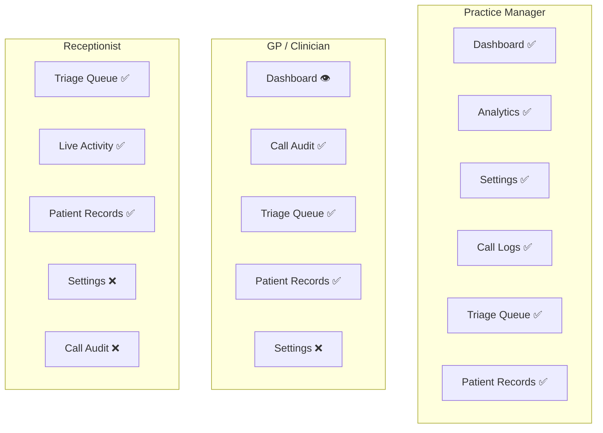
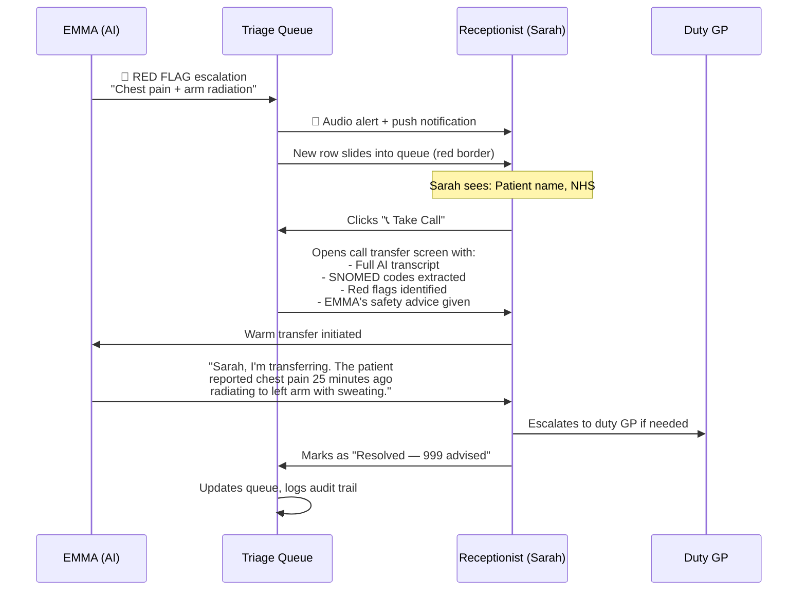
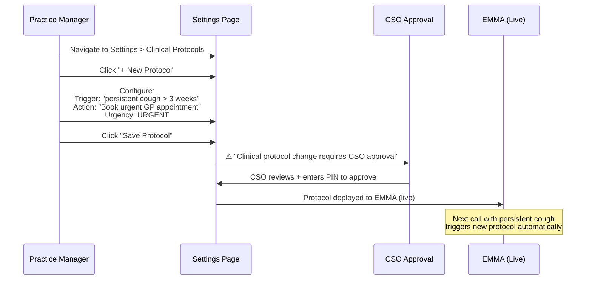
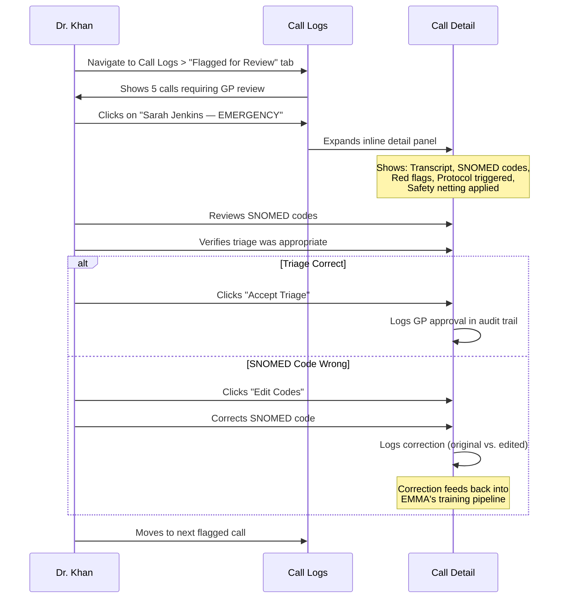

# EMMA — UI/UX Design Specification
## Complete Interface Architecture Derived from Product Requirements
### QuantumLoopAI | Version 1.0 | February 2026

---

## Table of Contents

1. [Design Philosophy](#1-design-philosophy)
2. [User Roles & Access Matrix](#2-user-roles--access-matrix)
3. [Information Architecture](#3-information-architecture)
4. [Design System](#4-design-system)
5. [Screen Specifications](#5-screen-specifications)
6. [User Flows](#6-user-flows)
7. [Real-Time Systems](#7-real-time-systems)
8. [Accessibility & Compliance](#8-accessibility--compliance)
9. [Responsive Strategy](#9-responsive-strategy)
10. [Frontend Technical Recommendations](#10-frontend-technical-recommendations)

---

## 1. Design Philosophy

### 1.1 Design Principles (Derived from PRD Section 4)

The PRD establishes 5 product principles. Each directly informs a UI design principle:

| PRD Principle | UI Design Principle | Implementation |
|---|---|---|
| **Clinically Safe** | **Safety-First Visual Hierarchy** | Red is reserved exclusively for clinical danger. Red flag alerts are never dismissible without action. Safety metrics are always visible, never buried. |
| **Patient-First** | **Zero-Friction Telephony** | Patients never interact with a UI — EMMA is voice-only for patients. The dashboard exists for staff who monitor EMMA. |
| **Staff Empowerment** | **Actionable, Not Informational** | Every data point on screen leads to an action. No vanity metrics. If a number is shown, the user can click it to act. |
| **NHS-Native** | **NHS Design Language** | Follow the [NHS Digital Service Manual](https://service-manual.nhs.uk/) color and typography conventions. Use NHS-familiar terminology (ODS codes, SNOMED, PDS). |
| **Transparent & Auditable** | **Full Audit Trail** | Every AI decision is traceable in the UI. Call transcripts, SNOMED codes, agent reasoning, and safety net applications are all visible and exportable. |

### 1.2 Design Constraints

| Constraint | Source | Impact on UI |
|---|---|---|
| WCAG 2.1 AA | PRD §11.3 | All components meet accessibility standards — contrast ratios, keyboard nav, screen reader support |
| NHS DTAC Usability | PRD §9.1 | Must pass DTAC usability assessment — tested with real practice staff |
| Multi-tenant | PRD §11.2 | Each practice sees only their data. Practice branding/config reflected in UI |
| DCB0129 Compliance | PRD §9.2 | Clinical audit screens must satisfy CSO review requirements |
| Real-time ops | PRD §14.4 | Dashboard and triage queue must show live data with <30s latency |

---

## 2. User Roles & Access Matrix

### 2.1 Roles (Derived from PRD Section 5 — Personas)

| Role | Persona | Primary Screens | Permission Level |
|---|---|---|---|
| **Practice Manager** | Helen / Practice-level | Dashboard, Analytics, Settings, Call Logs | Full admin — all screens, configuration |
| **GP / Clinician** | Dr. Khan | Call Audit, Triage Queue, Patient Records | Clinical review — audit calls, review red flags, approve triage |
| **Receptionist** | Sarah | Triage Queue, Live Activity, Patient Records | Operational — take escalated calls, manage queue, view patient context |
| **Clinical Safety Officer** | CSO (not in personas) | Call Audit, Risk Governance, Compliance | Governance — review safety cases, approve protocols, export compliance |
| **PCN / ICB Manager** | Helen (PCN level) | Analytics (multi-practice), Compliance Reports | Read-only — aggregate analytics across practices |
| **QuantumLoopAI Admin** | Internal support | System Health, Tenant Config | Super admin — system monitoring, tenant management |

### 2.2 Role-Based Screen Access



---

## 3. Information Architecture

### 3.1 Global Navigation

The navigation structure is driven by the 6 PRD feature areas (F1-F6) and the 4 KPI domains (Patient, Practice, Business, Technical):

```
┌─────────────────────────────────────────────────────────┐
│  EMMA Logo + "AI GP Receptionist"                       │
│                                                         │
│  [🔍 Search patients or records]                        │
│                                                         │
│  Dashboard | Triage Queue | Call Logs | Patient Records │
│  Analytics | Settings                                   │
│                                                         │
│  [🔴 Red Flags (n)] [🔔 Notifications] [👤 User Menu]  │
└─────────────────────────────────────────────────────────┘
```

| Nav Item | Maps to PRD | Primary User |
|---|---|---|
| **Dashboard** | §14 Success Metrics — all 4 KPI categories | Practice Manager |
| **Triage Queue** | §7 F2 Clinical Triage + Agent Instructions §9 Escalation | Receptionist, GP |
| **Call Logs** | §7 F1-F6 all features + §9.2 Clinical Safety | GP, CSO |
| **Patient Records** | §10.1 Clinical System Integration | All clinical staff |
| **Analytics** | §7 F8 PCN/ICB Analytics Dashboard | Practice Manager, PCN Manager |
| **Settings** | §7 F2 protocols, §7 F6 knowledge base, Agent Instructions §14 config | Practice Manager |
| **Red Flags** | §9.2 Red Flag Protocols, Agent Instructions §11 Safety Protocols | GP (always visible, all screens) |

### 3.2 Complete Sitemap

```mermaid
graph TD
    ROOT["EMMA Platform"]

    ROOT --> DASH["Dashboard"]
    DASH --> DASH_KPI["KPI Overview"]
    DASH --> DASH_CAP["Capacity & Demand"]
    DASH --> DASH_SENT["Patient Sentiment"]
    DASH --> DASH_LIVE["Live Activity Feed"]

    ROOT --> TRIAGE["Triage Queue"]
    TRIAGE --> TQ_ALL["All Escalations"]
    TRIAGE --> TQ_RED["Red Flags"]
    TRIAGE --> TQ_HIGH["High Priority"]
    TRIAGE --> TQ_MINE["Assigned to Me"]
    TRIAGE --> TQ_FUP["Follow-ups"]
    TRIAGE --> TQ_DONE["Completed Today"]

    ROOT --> CALLS["Call Logs"]
    CALLS --> CL_ALL["All Calls"]
    CALLS --> CL_TRIAGE["Clinical Triage"]
    CALLS --> CL_RX["Prescriptions"]
    CALLS --> CL_ADMIN["Administrative"]
    CALLS --> CL_DETAIL["Call Detail View"]
    CL_DETAIL --> CL_TRANS["Transcript"]
    CL_DETAIL --> CL_SNOMED["SNOMED Codes"]
    CL_DETAIL --> CL_ACTIONS["Actions Taken"]
    CL_DETAIL --> CL_AUDIO["Audio Playback"]

    ROOT --> PATIENTS["Patient Records"]
    PATIENTS --> PT_SEARCH["Patient Search"]
    PATIENTS --> PT_PROFILE["Patient Profile"]
    PT_PROFILE --> PT_HISTORY["Call History"]
    PT_PROFILE --> PT_APPTS["Appointments"]
    PT_PROFILE --> PT_MEDS["Medications"]
    PT_PROFILE --> PT_RESULTS["Test Results"]

    ROOT --> ANALYTICS["Analytics"]
    ANALYTICS --> AN_OVERVIEW["Performance Overview"]
    ANALYTICS --> AN_DEMAND["Demand & Capacity"]
    ANALYTICS --> AN_CLINICAL["Clinical Quality"]
    ANALYTICS --> AN_PATIENT["Patient Satisfaction"]
    ANALYTICS --> AN_COMPARE["Practice Comparison"]
    ANALYTICS --> AN_EXPORT["Report Export"]

    ROOT --> SETTINGS["Settings"]
    SETTINGS --> SET_VOICE["Voice & Language"]
    SETTINGS --> SET_PROTO["Clinical Protocols"]
    SETTINGS --> SET_APPT["Appointment Booking Rules"]
    SETTINGS --> SET_KB["Knowledge Base"]
    SETTINGS --> SET_INT["System Integration"]
    SETTINGS --> SET_PRIV["Privacy & GDPR"]
    SETTINGS --> SET_TEAM["Team & Permissions"]

    ROOT --> GOVERNANCE["Clinical Governance"]
    GOVERNANCE --> GOV_RISK["Risk Governance"]
    GOVERNANCE --> GOV_COMP["Compliance Dashboard"]
    GOVERNANCE --> GOV_SAFETY["Patient Safety"]
    GOVERNANCE --> GOV_HAZARD["Hazard Log"]
```



---

## 4. Design System

### 4.1 Color Palette

Derived from NHS Design System conventions and EMMA's brand identity:

```
── PRIMARY BRAND ──────────────────────────────
EMMA Blue:         #2563EB    CTAs, active states, brand identity
EMMA Blue Dark:    #1E40AF    Hover states, active nav
EMMA Blue Light:   #EFF6FF    Selected rows, light backgrounds

── SEMANTIC COLORS ────────────────────────────
Danger Red:        #DC2626    Red flags, emergency, critical alerts
Danger Red BG:     #FEF2F2    Red flag card backgrounds
Warning Amber:     #F59E0B    Urgent status, processing states
Warning Amber BG:  #FFFBEB    Warning card backgrounds
Success Green:     #16A34A    Resolved, confirmed, system online
Success Green BG:  #F0FDF4    Success card backgrounds
Info Blue:         #3B82F6    Informational badges, links
Info Blue BG:      #EFF6FF    Info card backgrounds

── NEUTRALS ───────────────────────────────────
Navy 900:          #0F172A    Top nav bar background
Navy 800:          #1E293B    Headings, primary text
Navy 600:          #475569    Secondary headings
Gray 500:          #64748B    Body text, descriptions
Gray 400:          #94A3B8    Placeholder text, muted labels
Gray 200:          #E2E8F0    Borders, dividers
Gray 100:          #F1F5F9    Alternate row backgrounds
Gray 50:           #F8FAFC    Page background
White:             #FFFFFF    Cards, content areas
```

> [!IMPORTANT]
> **Red (#DC2626) must ONLY be used for clinical safety concerns** — emergency badges, red flag alerts, critical system errors. Using red for non-clinical purposes (e.g., delete buttons, form errors) dilutes its life-safety significance. Form validation errors use amber instead.

### 4.2 Typography

| Token | Font | Weight | Size | Usage |
|---|---|---|---|---|
| `heading-1` | Inter | Bold (700) | 28px / 1.2 | Page titles ("Practice Overview") |
| `heading-2` | Inter | Semi-Bold (600) | 22px / 1.3 | Section headers ("Capacity Saved") |
| `heading-3` | Inter | Semi-Bold (600) | 18px / 1.4 | Card titles, subsection headers |
| `body` | Inter | Regular (400) | 14px / 1.5 | General body text, descriptions |
| `body-small` | Inter | Regular (400) | 13px / 1.5 | Secondary info, metadata |
| `metric-large` | Inter | Bold (700) | 36px / 1.1 | Big KPI numbers ("1,248", "08s") |
| `metric-medium` | Inter | Bold (700) | 24px / 1.2 | Secondary metrics ("42 hrs") |
| `badge` | Inter | Semi-Bold (600) | 11px / 1.0 | Status badges, uppercase, letter-spaced |
| `table-header` | Inter | Semi-Bold (600) | 12px / 1.0 | Table column headers, uppercase |
| `caption` | Inter | Regular (400) | 12px / 1.4 | Footer text, timestamps, labels |
| `code` | JetBrains Mono | Regular (400) | 13px / 1.4 | NHS numbers, SNOMED codes, EMIS slot types |

### 4.3 Component Specifications

#### 4.3.1 KPI Metric Card
Maps to: PRD §14 (all 16 KPIs)

```
┌──────────────────────────────────────┐
│  Total Calls Answered          📞   │  ← caption + icon (top-right)
│                                      │
│  1,248  100% Target                  │  ← metric-large + success badge
│                                      │
│  ↗ +5.2% from yesterday             │  ← trend indicator (green/red)
└──────────────────────────────────────┘

Specs:
- Background: white
- Border: 1px solid Gray 200
- Border-radius: 12px
- Padding: 20px 24px
- Shadow: 0 1px 3px rgba(0,0,0,0.08)
- Icon: 24px, muted color matching semantic type
- Trend arrow: green (up=good) or red (up=bad, context-dependent)
```

#### 4.3.2 Status Badge
Maps to: PRD §7 F2 urgency classification + Agent Instructions agent types

```
Priority Badges:
  🔴 EMERGENCY  — bg: #DC2626, text: white, border-radius: 9999px
  🟠 URGENT     — bg: #F59E0B, text: white
  🔵 SOON       — bg: #3B82F6, text: white
  🟢 ROUTINE    — bg: #16A34A, text: white

Intent Badges:
  TRIAGE        — bg: #EFF6FF, text: #2563EB, border: 1px #2563EB
  BOOKING       — bg: #F0FDF4, text: #16A34A, border: 1px #16A34A
  PRESCRIPTION  — bg: #FFF7ED, text: #EA580C, border: 1px #EA580C
  ADMIN         — bg: #F5F3FF, text: #7C3AED, border: 1px #7C3AED
  TEST RESULTS  — bg: #ECFDF5, text: #059669, border: 1px #059669

Status Badges:
  ✅ SUCCESS     — bg: #F0FDF4, text: #16A34A
  ⏳ PROCESSING  — bg: #FFFBEB, text: #D97706
  🔄 ESCALATING  — bg: #FEF2F2, text: #DC2626
  👁️ REQUIRES GP — bg: #FEF2F2, text: #DC2626

All badges: font-size: 11px, font-weight: 600, uppercase, 
            padding: 2px 8px, border-radius: 9999px
```

#### 4.3.3 Live Activity Card
Maps to: PRD §7 F1 (Intelligent Call Answering) — showing calls in real-time

```
┌──────────────────────────────────────┐
│  Patient: Sarah J.         TRIAGE   │  ← patient name + intent badge
│                                      │
│  "Experiencing shortness of breath   │  ← quoted snippet from call
│   and chest discomfort..."           │
│                                      │
│  ⏱ 02:45 mins          Monitor Live │  ← duration + action link
└──────────────────────────────────────┘

Specs:
- Background: white
- Left border: 3px solid (color matches intent badge)
- Border-radius: 8px
- Margin-bottom: 12px
- Quote: italic, Gray 500 text
- "Monitor Live": EMMA Blue link, underline on hover
```

#### 4.3.4 Call Transcript View
Maps to: PRD §8.3 (Agentic AI call flow) + Agent Instructions (conversation patterns)

```
CALL TRANSCRIPT                    EXTRACTED SNOMED CT CODES
                                   ┌─────────────────────────┐
EMMA (AI)                          │ 29857009 | Chest pain   │
┌────────────────────────┐         │ 26703007 | Dyspnea      │
│ "Hello Sarah. I'm EMMA.│         ├─────────────────────────┤
│ How can I help today?" │         │ 41940003 | MI suspect   │ ← yellow bg = flagged
└────────────────────────┘         └─────────────────────────┘

                    PATIENT         ⚠ SYSTEM FLAGGED 'RED FLAGS'
          ┌────────────────────┐   ⊘ Cardiac chest pain → arm
          │ "I'm having some   │   ⊘ Acute respiratory distress
          │ **sharp chest      │
          │ pains** that       │   GP ACTION TAKEN
          │ started about 20   │   ┌──────────────────────────┐
          │ minutes ago."      │   │ [Accept Triage & Alert 999]│
          └────────────────────┘   │ [Edit Codes]  [Dismiss]   │
                                   └──────────────────────────┘
EMMA (AI)
┌────────────────────────┐
│ [Protocol: Cardiac     │  ← shows which protocol triggered
│ Emergency initiated]   │
│ "I'm concerned about   │
│ those symptoms..."     │
└────────────────────────┘

Specs:
- EMMA messages: left-aligned, blue label ("EMMA (AI)")
- Patient messages: right-aligned, gray label ("PATIENT")
- Red-flag keywords: bold + red highlight (#DC2626 bg with opacity)
- Protocol notes: monospace, gray bg, italic
- SNOMED chips: rounded, gray bg, code in monospace font
- Flagged SNOMED chips: yellow/amber bg for suspected conditions
```

#### 4.3.5 Triage Queue Row
Maps to: PRD §7 F2 (Clinical Triage) + Agent Instructions §9 (Escalation)

```
┌────┬──────────┬──────────────────────────────┬────────┬──────────┐
│ 🔴 │ Johnathan│ ⚕ AI detected **chest pain  │⏱ 2m14s│[📞 Take  │
│RED │ Doe      │   & shortness of breath**.   │        │  Call]   │
│FLAG│ 65 M     │   History of hypertension.   │        │          │
│    │ NHS: 483 │   Recommended immediate      │        │  [👁️]   │
│    │ 291 0041 │   transfer to clinical lead. │        │          │
└────┴──────────┴──────────────────────────────┴────────┴──────────┘

Specs:
- Row height: auto (min 80px)
- Priority column: colored badge, 80px width
- Patient column: name (bold), demographics (small), NHS# (monospace)
- AI Summary: full paragraph, keywords bolded, max 3 lines with expand
- Wait Time: clock icon, color degrades (green <2m, amber 2-5m, red >5m)
- Actions: primary CTA matches urgency (Take Call for red flags)
- Row hover: subtle blue bg (#EFF6FF)
- Red Flag rows: left border 4px #DC2626
```

#### 4.3.6 Safety Toggle (Settings)
Maps to: Agent Instructions §11 (Non-Negotiable Rules) + PRD §9.2

```
┌──────────────────────────────────────────────────────────┐
│  🔴 Immediate 999 Escalation                    [ON] ⬤ │
│                                                          │
│  AI will immediately transfer caller to emergency        │
│  services if chest pain or stroke symptoms are           │
│  mentioned.                                              │
│                                                          │
│  ⚠ Disabling requires Clinical Safety Officer approval   │
└──────────────────────────────────────────────────────────┘

Specs:
- Card with left border: 4px solid #DC2626 for safety-critical toggles
- Toggle: blue when ON, gray when OFF
- Disabling safety toggles: shows confirmation modal requiring CSO PIN
- Warning text: amber, italic, visible when toggle is ON
- Cannot be toggled by receptionist role — Practice Manager + CSO only
```

---

## 5. Screen Specifications

### 5.1 Dashboard — Practice Overview

**Serves**: Practice Manager (Helen), GP Partner (Dr. Khan)
**Maps to**: PRD §14 (all KPIs), §7 F1 (call answering), §12.4 (ROI metrics)

#### Layout

```
┌─────────────────────────────────────────────────────────────┐
│  GLOBAL NAV BAR                                             │
├─────────────────────────────────────────────────────────────┤
│  Practice Overview                                          │
│  Welcome back, [User]. Real-time performance of EMMA.       │
│  ┌──────────┐  ┌──────────┐                                │
│  │📅 Today   │  │📥 Export  │                                │
│  └──────────┘  └──────────┘                                │
├───────────┬───────────┬───────────────────────────────────────┤
│           │           │                                      │
│  KPI 1    │  KPI 2    │  KPI 3                               │
│  Total    │  Avg Wait │  Resolution                          │
│  Calls    │  Time     │  Rate                                │
│  1,248    │  08s      │  84%                                 │
│           │           │                                      │
├───────────┴───────────┼──────────────────────────────────────┤
│                       │                                      │
│  CAPACITY SAVED       │  LIVE ACTIVITY                       │
│  (Receptionist Hrs)   │  12 Active Calls                     │
│                       │                                      │
│  [Weekly bar chart]   │  [Live call card 1]                  │
│  42 hrs avg daily     │  [Live call card 2]                  │
│                       │  [Live call card 3]                  │
├───────────────────────┤  [Live call card 4]                  │
│                       │                                      │
│  PATIENT SENTIMENT    │  [View All Activity →]               │
│  (4-week trend)       │                                      │
│                       │                                      │
│  [Area chart]         │                                      │
│  92% positive         │                                      │
│                       │                                      │
├───────────────────────┴──────────────────────────────────────┤
│  FOOTER: AI Core: ● Online | NHS Spine: ● Connected | 14:32 │
└─────────────────────────────────────────────────────────────┘
```

#### Data Mapping (PRD → Dashboard)

| Dashboard Element | PRD KPI Reference | Source |
|---|---|---|
| Total Calls Answered | §14.1 Call answer rate (100% target) | Real-time aggregation from call service |
| Avg Wait Time | §14.1 Average wait time (<10s target) | ASR service — time from ring to EMMA greeting |
| Resolution Rate | §14.1 Call resolution rate (>70% target) | Orchestrator — calls resolved without human |
| Capacity Saved | §14.2 Receptionist call volume reduction (>80%) | Hours saved = calls × avg duration |
| Patient Sentiment | §14.1 Patient satisfaction CSAT (>85%) | Post-call survey or sentiment analysis |
| Live Activity | §7 F1 — active calls in progress | WebSocket from orchestrator service |

#### Interactions
- **Click KPI card** → drill down to filtered Call Logs for that metric
- **Click live activity card** → expand call details or navigate to transcript
- **"Monitor Live" link** → opens real-time transcript view for active call
- **Date picker** → change dashboard date range (today, 7d, 30d, custom)
- **Export Report** → generate PDF/CSV with all metrics for the selected period

---

### 5.2 Triage Queue — Live Escalation

**Serves**: Receptionist (Sarah), Duty GP (Dr. Khan)
**Maps to**: PRD §7 F2 (Clinical Triage), Agent Instructions §9 (Escalation), §4 (Triage)

#### Layout

```
┌─────────────────────────────────────────────────────────────┐
│  GLOBAL NAV BAR                          [🔴 Red Flags (3)] │
├────────────┬────────────────────────────────────────────────┤
│  SIDEBAR   │  ⚡ LIVE QUEUE                                 │
│            │  Patient Triage Queue                          │
│ LIVE STATUS│  Real-time AI escalations requiring            │
│ ● Esc (12)│  practice intervention                         │
│ ◇ Red (2) │                                                │
│ ○ F-ups   │  [⏸ Pause Intake]  [🔄 Refresh Queue]          │
│ ○ Done    │                                                │
│            │  TABS: All(12) | High(4) | Red Flags(2) | Me(3)│
│ TOOLS      │                                                │
│ ○ Reports │  ┌────────────────────────────────────────────┐ │
│ ○ Chat    │  │ Table: Priority | Patient | AI Summary |   │ │
│            │  │        Wait Time | Direct Actions          │ │
│ Queue      │  │                                            │ │
│ Health     │  │ [Row 1: RED FLAG — Chest pain]             │ │
│ ████▌ 4m  │  │ [Row 2: URGENT — Mental health]            │ │
│ Stable     │  │ [Row 3: STANDARD — Sick note]              │ │
│            │  └────────────────────────────────────────────┘ │
│            │                                                │
│            │  ┌──────────┬──────────┬──────────┐           │
│            │  │ Smart    │ Pre-     │ Full     │           │
│            │  │ Context  │ Verified │ Transcript│          │
│            │  └──────────┴──────────┴──────────┘           │
├────────────┴────────────────────────────────────────────────┤
│  FOOTER STATUS BAR                                          │
└─────────────────────────────────────────────────────────────┘
```

#### Priority-Based Actions (Derived from Agent Instructions §9)

| Priority | Wait Time Color | Primary CTA | Secondary Actions |
|---|---|---|---|
| 🔴 RED FLAG | Red immediately | **📞 Take Call** | View transcript, Assign to GP |
| 🟠 URGENT | Amber after 3m | **📞 Take Call** | 💬 Send SMS, View details |
| 🔵 SOON | Amber after 10m | **✏️ Action** | 💬 Send SMS, Assign |
| 🟢 STANDARD | Amber after 15m | **✏️ Action** | More options (⋯) |

#### Queue Behaviors
- **New RED FLAG** → browser push notification + audio alert + row flashes red 3 times
- **New URGENT** → gentle chime + row slides in at top of queue
- **Wait time crosses threshold** → timer turns amber/red + receptionist pinged
- **Take Call clicked** → initiates warm transfer with full AI context passed to receptionist
- **Queue empty** → celebratory empty state: "All caught up! 🎉 No escalations pending."

---

### 5.3 Call Logs — Audit & Governance

**Serves**: GP (Dr. Khan), Clinical Safety Officer
**Maps to**: PRD §9.2 (Clinical Safety), §7 F2 (Triage), Agent Instructions §4 (Triage examples)

#### Layout

```
┌─────────────────────────────────────────────────────────────┐
│  GLOBAL NAV BAR                                             │
├────────────┬────────────────────────────────────────────────┤
│  SIDEBAR   │  Call Audit & Governance                       │
│            │  Review AI clinical sessions and compliance     │
│ Clinical   │                                                │
│ Portal     │  [📥 Export Audit Log]  [🔍 Filters]           │
│ DCB0129    │                                                │
│            │  TABS: All | Clinical Triage | Prescriptions   │
│ ○ Overview │        | Administrative | Flagged for Review    │
│ ● Audit   │                                                │
│ ○ Risk    │  TABLE: Patient | Time | Intent | Urgency |    │
│ ○ Compliance│        Status                                 │
│ ○ Safety  │                                                │
│ ○ Settings│  [Expanded row — Transcript + SNOMED + Flags + │
│            │   GP Action buttons]                           │
│            │                                                │
│            │  [Paginated table — more rows]                 │
│            │                                                │
│            │  ┌──────────┬──────────┬────────────┐         │
│            │  │ Clinical │ Triage   │ Practice   │         │
│            │  │ Safety   │ Accuracy │ Capacity   │         │
│            │  │ 99.8%    │ 94.2%    │ 42 hrs     │         │
│            │  │ DCB0129  │ GP Audit │ ~1.2 FTE   │         │
│            │  └──────────┴──────────┴────────────┘         │
├────────────┴────────────────────────────────────────────────┤
│  FOOTER STATUS BAR                                          │
└─────────────────────────────────────────────────────────────┘
```

#### Expanded Call Detail (Inline)

When a row is clicked, it expands to show:

| Section | Content | Source |
|---|---|---|
| **Call Transcript** | Full AI + Patient conversation with speaker labels | Call recording transcription |
| **SNOMED CT Codes** | Extracted clinical codes as chips | NLU + SNOMED service |
| **Red Flags Detected** | List of triggered safety protocols | Protocol engine |
| **Agent Reasoning** | Which agent handled, which protocol triggered, decision path | LangGraph agent runtime |
| **Safety Netting Applied** | Exact safety netting text spoken to patient | Safety netting engine |
| **GP Actions** | Accept / Edit Codes / Dismiss buttons | Clinical governance workflow |
| **Audio Playback** | Play button for call recording | Encrypted S3 recording |

#### Bottom KPI Trio (Derived from PRD §14.4)

| Metric | PRD Reference | DCB0129 Threshold |
|---|---|---|
| **Clinical Safety Score** | §14.4 Clinical safety incidents = 0 | >99.5% (DCB0129) |
| **AI Triage Accuracy** | §14.4 ASR accuracy >95% + clinical accuracy | Verified against GP audit samples |
| **Practice Capacity Saved** | §14.2 Receptionist call volume reduction >80% | Reported as hours + FTE equivalent |

---

### 5.4 Settings — AI Agent Configuration

**Serves**: Practice Manager
**Maps to**: PRD §7 F2 (protocols), §7 F6 (knowledge base), Agent Instructions §14 (config variables)

#### Settings Sections (Derived from Agent Instructions §14)

| Section | Configuration Items | Source |
|---|---|---|
| **Voice & Language** | Default accent (RP / Regional), multi-language support (add/remove), voice preview button | Agent Instructions §1 (voice characteristics), §13 (multilingual) |
| **Clinical Protocols** | Red flag rules, urgency thresholds, safety netting templates, protocol priority ordering | Agent Instructions §4 (Triage), §11 (Safety Protocols) |
| **Appointment Booking** | Symptom → Clinician mapping table, EMIS/SystmOne slot type codes, booking rules, SMS templates | Agent Instructions §5 (Appointment), PRD §7 F3 |
| **Knowledge Base** | Practice FAQs, import PDF/doc, create/edit/delete articles, public/private visibility | Agent Instructions §8 (Admin), PRD §7 F6 |
| **System Integration** | EMIS/SystmOne connection status, Accurx integration, NHS Spine sync status, last sync time | PRD §10 (Integration Requirements) |
| **Privacy & GDPR** | Data retention settings, consent recording toggle, DPIA access, patient data erasure requests | PRD §9.4 (Data Residency) |
| **Team & Permissions** | Staff accounts, role assignment, CSO designation, audit trail of setting changes | PRD §9.2 (CSO requirement) |

#### Safety-Critical Settings (Agent Instructions §11)

```
⚠ CLINICAL SAFETY SETTINGS — Changes require CSO approval

┌─ 999 Emergency Escalation ──────────────────────────┐
│  [ON ⬤]  AI immediately guides caller to 999        │
│          for life-threatening symptoms               │
│                                                      │
│  ⚠ Disabling this setting requires CSO PIN and       │
│    will be logged in the compliance audit trail       │
└──────────────────────────────────────────────────────┘

┌─ Red Flag Screening ────────────────────────────────┐
│  [ON ⬤]  Force clinical triage questionnaire        │
│          for all symptom-related calls               │
└──────────────────────────────────────────────────────┘

┌─ Safety Netting ────────────────────────────────────┐
│  [ON ⬤]  Mandatory safety advice at end of          │
│          every clinical interaction                  │
│                                                      │
│  ⛔ This setting cannot be disabled                  │
└──────────────────────────────────────────────────────┘
```

---

### 5.5 Patient Records

**Serves**: All clinical staff
**Maps to**: PRD §10.1 (Clinical System Integration), §7 F3-F5

#### Patient Profile Layout

```
┌─────────────────────────────────────────────────────────────┐
│  ← Back to Search                                           │
│                                                              │
│  👤 Sarah Jenkins                                            │
│  NHS: 485 922 1044  |  DOB: 14/03/1985  |  Female          │
│  Registered: Riverside Medical Centre                        │
│                                                              │
│  TABS: Call History | Appointments | Medications | Results    │
├─────────────────────────────────────────────────────────────┤
│                                                              │
│  CALL HISTORY (with EMMA)                                    │
│                                                              │
│  Today, 09:42 — Clinical Triage — 🔴 EMERGENCY              │
│    "Chest pain with radiating arm pain"                      │
│    → 999 guidance provided                                   │
│    [View Full Transcript]                                    │
│                                                              │
│  Feb 20, 14:15 — Appointment Booking — 🟢 ROUTINE           │
│    "Booked follow-up with Dr. Smith for Thursday 10am"       │
│    → ✅ Completed                                             │
│                                                              │
│  Feb 18, 08:32 — Prescription — 🟢 ROUTINE                  │
│    "Requested repeat: Metformin 500mg, Amlodipine 5mg"      │
│    → ✅ Submitted to GP                                       │
│                                                              │
└─────────────────────────────────────────────────────────────┘
```

---

### 5.6 Analytics

**Serves**: Practice Manager (Helen), PCN/ICB Manager
**Maps to**: PRD §7 F8 (PCN/ICB Analytics), §14 (all KPI categories)

#### Analytics Sections

| Section | Charts / Visualizations | PRD Source |
|---|---|---|
| **Performance Overview** | Calls answered (line), resolution rate (gauge), avg wait time (line) | §14.1 Patient Metrics |
| **Demand & Capacity** | Call volume heatmap (hour × day), peak hours, predicted demand | §11.2 Scalability, §7 F7 |
| **Clinical Quality** | Triage accuracy (bar), SNOMED code distribution, red flags over time | §14.4 Technical Metrics |
| **Patient Satisfaction** | CSAT trend (line), sentiment breakdown (pie), feedback word cloud | §14.1 Patient satisfaction |
| **Intent Distribution** | Appointments vs. Triage vs. Prescriptions vs. Admin (stacked bar) | §7 F1-F6 feature usage |
| **Staff Impact** | Receptionist hours saved (bar), escalation volume (line), staff satisfaction | §14.2 Practice Metrics |
| **Practice Comparison** | Multi-practice benchmark table (PCN managers only) | §7 F8 comparative benchmarking |
| **Report Export** | PDF report builder with date range, metric selection, practice branding | §7 F8 compliance reporting |

---

## 6. User Flows

### 6.1 Receptionist: Handling a Red Flag Escalation

This is the highest-stakes user flow — a patient with potential cardiac emergency.



### 6.2 Practice Manager: Configuring a New Clinical Protocol



### 6.3 GP: Auditing a Clinical Triage Call



---

## 7. Real-Time Systems

### 7.1 WebSocket Events

| Event | Trigger | UI Update | Screen |
|---|---|---|---|
| `call.started` | New call answered by EMMA | Add to Live Activity feed | Dashboard |
| `call.updated` | Intent classified, agent switched | Update intent badge on live card | Dashboard |
| `call.ended` | Call completed | Remove from live feed, update KPIs | Dashboard |
| `escalation.created` | EMMA escalates to human | New row in Triage Queue + alert | Triage Queue |
| `escalation.claimed` | Receptionist takes call | Remove from queue / mark as taken | Triage Queue |
| `red_flag.detected` | Red flag triggered during call | 🔴 badge counter increments, audio ping | Global nav (all screens) |
| `system.health` | Periodic heartbeat | Update footer status indicators | All screens |
| `kpi.updated` | Metric recalculated | Animate KPI card value change | Dashboard |

### 7.2 Notification Priority

| Level | Visual | Audio | Browser Push | Example |
|---|---|---|---|---|
| **P1 — Critical** | Red flash + modal | Urgent alarm tone | Yes + persistent | Red flag detected, system down |
| **P2 — High** | Toast notification (red) | Soft chime | Yes | New urgent escalation |
| **P3 — Medium** | Toast notification (blue) | None | Optional | New standard escalation |
| **P4 — Low** | Badge count only | None | No | Report generated, sync complete |

---

## 8. Accessibility & Compliance

### 8.1 WCAG 2.1 AA Requirements (PRD §11.3)

| Requirement | Implementation |
|---|---|
| **Color Contrast** | All text meets 4.5:1 ratio (normal) / 3:1 (large). Never rely on color alone. |
| **Keyboard Navigation** | All interactive elements reachable via Tab. Triage Queue navigable with arrow keys. |
| **Screen Reader** | All components have ARIA labels. Live regions for real-time updates. |
| **Focus Indicators** | Visible focus rings (2px blue) on all interactive elements. |
| **Motion Sensitivity** | `prefers-reduced-motion` respected. Animations can be disabled. |
| **Text Scaling** | UI functions correctly at 200% browser zoom. |
| **Touch Targets** | Minimum 44×44px tap targets for mobile/tablet. |

### 8.2 NHS DTAC Usability

| DTAC Domain | UI Response |
|---|---|
| **Usability** | User testing with real GP staff (receptionists, GPs, practice managers) |
| **Accessibility** | WCAG 2.1 AA compliance + NHS Accessible Information Standard |
| **Clinical Safety** | Red flag visibility, safety toggle protections, audit trail completeness |
| **Interoperability** | Settings screen shows integration status in real-time |

---

## 9. Responsive Strategy

| Breakpoint | Layout | Key Adaptations |
|---|---|---|
| **Desktop (≥1280px)** | Full layout — nav bar + sidebar + main content | All features available, optimal experience |
| **Laptop (1024-1279px)** | Condensed sidebar (icons only) + main content | KPI cards 2-column, charts below activity feed |
| **Tablet (768-1023px)** | Top nav + no sidebar + bottom tab bar | Triage Queue optimized for iPad — large tap targets |
| **Mobile (< 768px)** | Bottom tab nav + single column | Simplified dashboard, queue only, no analytics |

> [!IMPORTANT]
> The **Triage Queue** is the only screen that MUST work perfectly on tablet. Receptionists frequently use iPads at the front desk. The "📞 Take Call" button must be at least 48×48px and easily tappable.

---

## 10. Frontend Technical Recommendations

### 10.1 Technology Stack

| Layer | Technology | Rationale |
|---|---|---|
| **Framework** | Next.js 14+ (App Router) | SSR for SEO-less internal apps is still valuable for fast initial loads. RSC for data-heavy dashboard. |
| **Components** | shadcn/ui + Radix UI primitives | Accessible by default, unstyled primitives allow NHS-aligned theming |
| **Styling** | Tailwind CSS v4 | Design tokens for color/typography consistency, rapid prototyping |
| **Charts** | Recharts or Tremor | React-native, performant charting with clean healthcare-appropriate aesthetics |
| **Tables** | TanStack Table (React Table v8) | Powerful filtering, sorting, pagination, expandable rows |
| **Real-time** | Socket.io or native WebSocket | Live activity feed, triage queue, system status updates |
| **State** | TanStack Query (React Query v5) | Server state management, background revalidation, optimistic updates |
| **Auth** | NextAuth.js v5 | Multi-practice auth with role-based access, session management |
| **Icons** | Lucide React | Clean, consistent, professional icon set |
| **Fonts** | Inter (Google Fonts) | Clean geometric sans-serif, excellent readability at all sizes |
| **Audio** | Web Audio API | Call recording playback, notification sounds |

### 10.2 Key Packages

```json
{
  "dependencies": {
    "next": "^14.2",
    "@radix-ui/react-dialog": "^1.0",
    "@radix-ui/react-tabs": "^1.0",
    "@radix-ui/react-toggle": "^1.0",
    "@radix-ui/react-tooltip": "^1.0",
    "recharts": "^2.12",
    "@tanstack/react-query": "^5.0",
    "@tanstack/react-table": "^8.0",
    "socket.io-client": "^4.7",
    "next-auth": "^5.0",
    "lucide-react": "^0.340",
    "class-variance-authority": "^0.7",
    "clsx": "^2.1",
    "tailwind-merge": "^2.2",
    "date-fns": "^3.3",
    "zod": "^3.22"
  }
}
```

### 10.3 Project Structure

```
/app
  /dashboard          → Practice Overview (KPIs, charts, live feed)
  /triage-queue       → Live Escalation Queue
  /call-logs          → Call Audit & Governance
  /call-logs/[id]     → Individual call detail view
  /patient-records    → Patient search
  /patient-records/[id] → Patient profile
  /analytics          → Performance analytics
  /settings
    /voice            → Voice & Language config
    /protocols        → Clinical Protocols
    /appointments     → Booking rules
    /knowledge-base   → FAQ management
    /integrations     → System connections
    /privacy          → GDPR settings
    /team             → User management
  /governance
    /risk             → Risk governance
    /compliance       → Compliance dashboard
    /safety           → Patient safety
    /hazard-log       → DCB0129 hazard log

/components
  /ui                 → shadcn/ui base components
  /dashboard          → Dashboard-specific components
  /triage             → Triage queue components
  /call-logs          → Audit & call components
  /settings           → Settings components
  /shared             → Shared components (nav, footer, badges)

/lib
  /api                → API client functions
  /hooks              → Custom React hooks
  /utils              → Utility functions
  /types              → TypeScript type definitions
  /constants          → Design tokens, config constants

/providers
  /auth               → Authentication provider
  /socket             → WebSocket provider
  /query              → React Query provider
  /theme              → Theme provider
```

---

*This UI/UX specification should be used as the primary reference for frontend development, alongside the PRD for requirements validation, Technical Breakdown for API integration, and Agent Instructions for understanding EMMA's behavioral patterns.*
